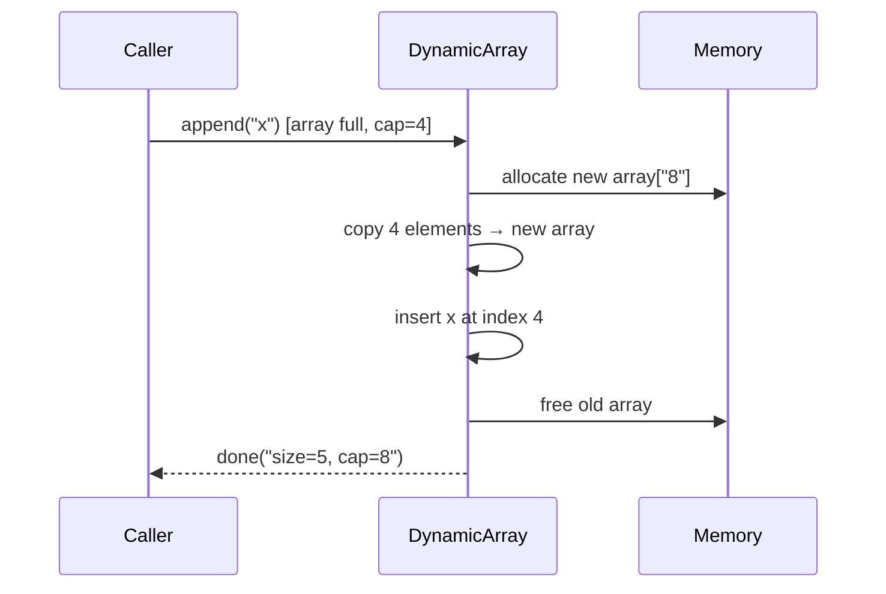

## Question

Explain how a dynamic array (like Java's `ArrayList` or Python's `list`) grows when it runs out of capacity. What growth factor does it use and why, and what is the amortized time complexity of appending an element?

## Answer

**Growth strategy:**

When an array is full and you append, the implementation:
1. Allocates a new backing array of size `capacity × factor` (typically 1.5× or 2×).
2. Copies all existing elements over.
3. Inserts the new element.

**Why 2× (or 1.5×)?**

- **2× growth:** Each element is copied at most O(log n) times total → amortized O(1) per append.
- **Proof (potential method):** After k doublings, total copies = 1+2+4+…+n = 2n. Over n appends, that's O(1) per append.
- **1.5× (Java ArrayList, CPython):** Wastes less memory at the cost of slightly more frequent copies — still amortized O(1).

**Growth factors < 1.5×** do NOT guarantee amortized O(1) because the series diverges.

**Space overhead:** A 2× factor wastes up to 50% of allocated capacity on average. Most implementations shrink (at 25% load) to avoid excessive waste after deletions.

**Contrast with linked lists:** Appending to a linked list is always O(1) but requires a heap allocation per element, hurting cache locality. Arrays win for sequential access patterns.

## Follow-ups

- What is the cost of inserting at the beginning of a dynamic array? How does `ArrayList` vs `LinkedList` compare for this in Java?
- How does Python's `list` decide when to shrink? Why doesn't it shrink at 50%?
- When would you pre-allocate capacity and why?
