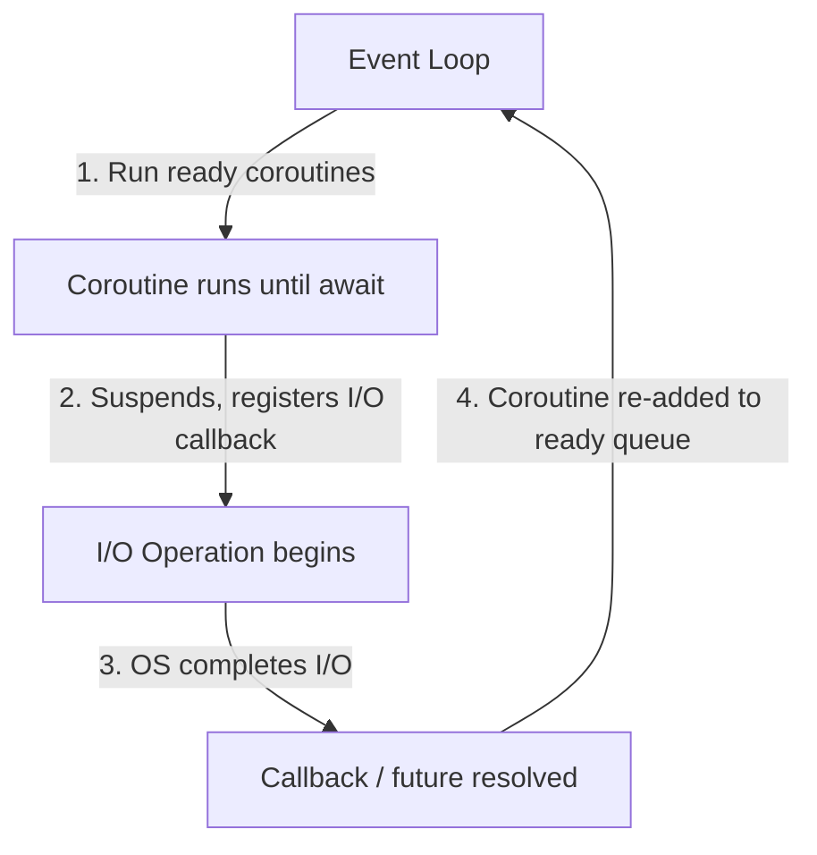

## Question

Explain how `async/await` is implemented — what a coroutine actually is, how the event loop drives execution, and where threads actually come in. Use Node.js or Python as a concrete model.

## Answer

**What async/await is NOT:** It's not magic parallelism. In Python and Node.js, async/await runs on a **single thread** using cooperative multitasking. It's a way to write non-blocking code that *looks* synchronous.

**What an `async` function returns:** A coroutine/Promise — a state machine that can pause at `await` points.

**Compilation of `async` functions (Python):**

The compiler transforms an `async def` into a state machine:

```python
# What you write:
async def fetch_data():
    result = await http_get(url)  # pause here
    return process(result)

# Conceptually compiled to:
def fetch_data_state_machine(state, value=None):
    if state == 0:
        future = http_get(url)
        return SUSPEND, future, 1   # suspend, give future to event loop
    if state == 1:
        result = value              # value = resolved future
        return DONE, process(result)
```

**Event loop drives execution:**



**Node.js model:** Single-threaded event loop. `libuv` handles I/O with OS async primitives (`epoll`/`kqueue`). CPU-bound work can be offloaded to the `worker_threads` module or the native thread pool (for file I/O).

**Python `asyncio`:** Similar single-threaded loop. CPU-bound work requires `ProcessPoolExecutor` (separate processes to bypass the GIL).

**Where threads come in:**
- JavaScript: main thread + `Worker` threads for CPU work.
- Python: `asyncio` is single-threaded; `ThreadPoolExecutor` adds threads for blocking I/O not yet async-ified.
- Java: virtual threads (Project Loom) mount onto platform threads — truly non-blocking with OS thread parking when blocked.

**Key insight:** Async/await shines for **I/O-bound concurrency** (many simultaneous network requests) with minimal resources. It fails for CPU-bound work unless you use threads/processes.

## Follow-ups

- What is the event loop's "task queue" vs "microtask queue" in JavaScript?
- Why can a single slow synchronous call block the entire Node.js event loop?
- How do virtual threads in Java 21 change the async programming model?
