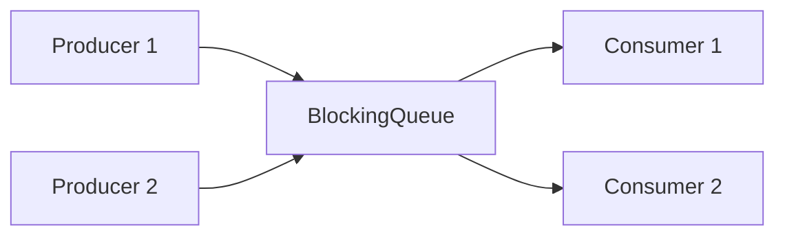

## Question

Compare Java's `BlockingQueue` implementations: `ArrayBlockingQueue`, `LinkedBlockingQueue`, `PriorityBlockingQueue`, `DelayQueue`, `SynchronousQueue`, and `LinkedTransferQueue`. When do you choose each?

## Answer

**`BlockingQueue` semantics:**
- `put(e)` — blocks if full.
- `take()` — blocks if empty.
- `offer(e, timeout)` / `poll(timeout)` — with timeout.
- Enables the producer-consumer pattern without manual signaling.

**`ArrayBlockingQueue(int capacity)`:**
- Backed by array. **Bounded** — must specify capacity.
- Single lock for both head and tail (less concurrency than Linked).
- **Fair mode** available (`new ArrayBlockingQueue(n, true)`) — queue-order access.
- Use when: bounded buffer with fairness matters, or you want to prevent unbounded memory growth.

**`LinkedBlockingQueue([int capacity])`:**
- Backed by linked nodes. **Optionally bounded** (default: `Integer.MAX_VALUE` = effectively unbounded).
- Two separate locks (head lock, tail lock) → higher throughput than Array.
- Use when: default producer-consumer queue in thread pools (`ThreadPoolExecutor` uses this).

**`PriorityBlockingQueue`:**
- Unbounded. Elements ordered by natural order or `Comparator`.
- No blocking on put (unbounded). `take()` blocks only when empty.
- Use when: tasks have priorities (job scheduler, Dijkstra's queue).

**`DelayQueue`:**
- Unbounded. Elements must implement `Delayed.getDelay()`. Elements are only available after their delay expires.
- Use when: scheduled task execution (cron-like), TTL cache eviction, retry with backoff.

**`SynchronousQueue`:**
- Zero capacity — each `put` must wait for a `take` and vice versa (rendezvous).
- Used in `Executors.newCachedThreadPool()` — direct handoff to a thread.
- Use when: you want to hand off work to exactly one consumer immediately.

**`LinkedTransferQueue`:**
- Unbounded. Combines `SynchronousQueue` (direct transfer if consumer waiting) and `LinkedBlockingQueue` (queue if no consumer).
- Slightly better throughput than `LinkedBlockingQueue` for producer-consumer.

| Queue | Bounded | Ordering | Blocking put? |
|---|---|---|---|
| `ArrayBlockingQueue` | ✓ | FIFO | ✓ |
| `LinkedBlockingQueue` | Optional | FIFO | If bounded |
| `PriorityBlockingQueue` | ✗ | Priority | ✗ |
| `DelayQueue` | ✗ | Delay | ✗ |
| `SynchronousQueue` | 0 | N/A | Always |

## Follow-ups

- How does `ThreadPoolExecutor` use `BlockingQueue` for task dispatch?
- What is the memory overhead of `LinkedBlockingQueue` vs `ArrayBlockingQueue`?
- How do you implement a rate limiter using `DelayQueue`?
