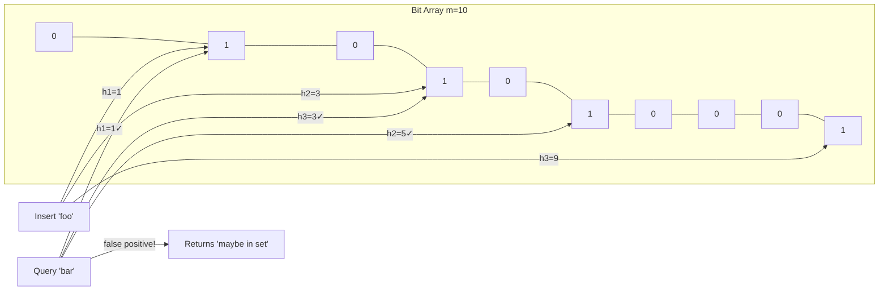

## Question

Explain the Bloom filter data structure: how it works, what operations it supports, and why it can produce false positives but never false negatives. How do you choose the optimal number of hash functions and bit array size?

## Answer

**Structure:** A bit array of size `m` and `k` independent hash functions. Initially all bits = 0.

**Insert(x):** Hash x with each of k functions → set those k bits to 1.

**Query(x):** Hash x with each of k functions → if **all** k bits are 1, return "possibly in set". If **any** bit is 0, return "definitely not in set".

**Why no false negatives:** If x was inserted, all k of its bits were set to 1. Querying x will always find those bits set. No deletion is possible without risking false negatives (unless using a counting Bloom filter).

**False positive rate:**
With n elements inserted, m bits, k hash functions:
`p ≈ (1 - e^(-kn/m))^k`

**Optimal k** (given m and n): `k = (m/n) · ln(2)`

**Optimal m** (given desired false positive rate p):
`m = -n · ln(p) / (ln 2)²`

**Rule of thumb:** ~10 bits per element gives ~1% false positive rate.

**Use cases:**
- **Database query acceleration:** Check Bloom filter before expensive disk lookup (e.g., Cassandra, RocksDB use this to avoid reading SSTable files for missing keys).
- **Crawlers:** Avoid re-crawling URLs.
- **Chrome Safe Browsing:** Check malicious URLs locally.
- **CDN:** Avoid caching one-hit-wonder objects.

**Variants:** Counting Bloom filter (supports deletions), Cuckoo filter (supports deletions, better cache performance).

## Follow-ups

- How does a counting Bloom filter support deletions? What is the space cost?
- How does RocksDB use Bloom filters per SSTable level?
- Compare Bloom filter to a hash set — when is the space saving worth the false positives?
