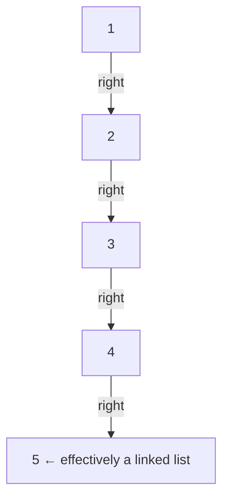

## Question

Explain the Binary Search Tree invariant, its expected vs worst-case complexities, and what causes it to degrade. How do self-balancing BSTs (AVL, Red-Black) fix this?

## Answer

**BST invariant:** For every node N: all keys in left subtree < N.key < all keys in right subtree.

**Operations (height-dependent):**

| Operation | Average | Worst (unbalanced) |
|---|---|---|
| Search | O(log n) | O(n) |
| Insert | O(log n) | O(n) |
| Delete | O(log n) | O(n) |
| Min/Max | O(log n) | O(n) |
| Inorder (sorted) | O(n) | O(n) |

**Degenerate case:** Insert `[1, 2, 3, 4, 5]` in sorted order → a right-skewed linked list. Height = n. All operations become O(n).

**Self-balancing solutions:**

**AVL Tree:** Strictly balanced — height difference between left/right subtrees ≤ 1 for every node. After insert/delete, rotations restore balance. Height ≤ 1.44 log n. Faster lookups than Red-Black but more rotations on insert/delete. Used in: databases, when read-heavy.

**Red-Black Tree:** 5 invariants ensure height ≤ 2 log n. Fewer rotations on insert/delete (at most 3). Amortized O(1) rotations for inserts. Used in: Java `TreeMap`/`TreeSet`, Linux CFS scheduler, C++ `std::map`.

**When to use BST over hash map:**
- Need sorted order or range queries.
- Need floor/ceiling (predecessor/successor).
- Need ordered iteration.

Hash map wins for pure O(1) point lookups.

**Deletion from BST:** Three cases:
1. Leaf → just remove.
2. One child → replace with child.
3. Two children → replace with in-order successor (leftmost node of right subtree), then delete the successor.

## Follow-ups

- Walk through a left rotation in an AVL tree.
- Why does Java's `HashMap` use a Red-Black tree for overflow buckets (Java 8+)?
- How does a B-tree generalize BSTs for disk storage?
