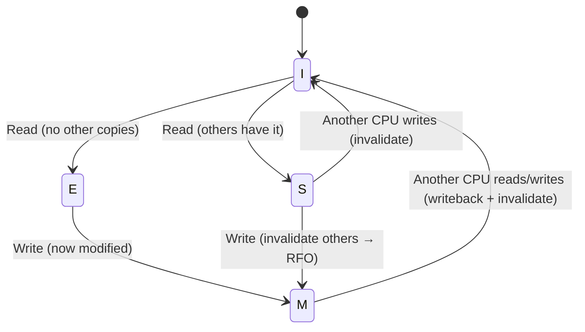
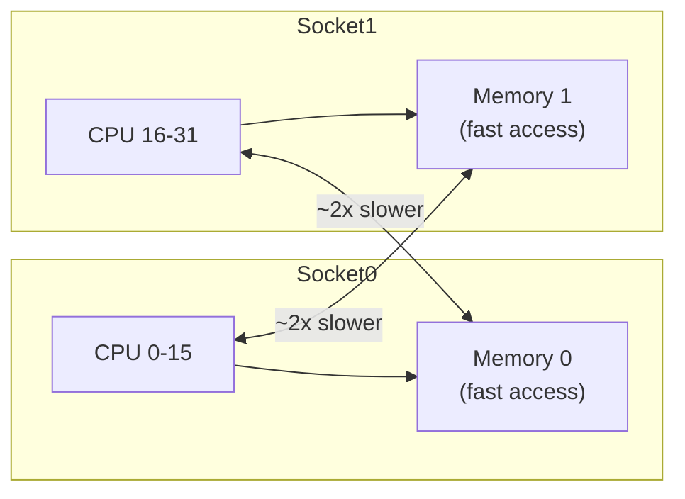

## Question

Explain the MESI cache coherency protocol and how it impacts concurrent programming performance. What are the performance implications of cache line bouncing, and how does NUMA add another layer?

## Answer

**Why cache coherence is needed:** In an SMP (Symmetric Multi-Processing) system, each CPU has its own L1/L2 cache. When two CPUs cache the same memory location and one writes, the other must see the updated value — but how?

**MESI protocol states for a cache line:**

| State | Meaning |
|---|---|
| **M** (Modified) | This cache has the only copy; it's dirty (not written to memory) |
| **E** (Exclusive) | This cache has the only copy; it's clean |
| **S** (Shared) | Multiple caches have this line; all clean |
| **I** (Invalid) | This cache line is stale |



**Read-For-Ownership (RFO):** When a CPU wants to write a cache line in state S or I, it broadcasts an "invalidate" message to other CPUs (they transition to I). This takes 100-300 cycles — much more than an L1 cache hit (4 cycles).

**Cache line bouncing (ping-pong):** Two CPUs alternately write to the same cache line. Each write triggers an RFO, flushes the other's copy. The line bounces between caches at memory bus speed.

**Performance impact:**
```
L1 cache hit:      ~4 cycles
L2 cache hit:      ~12 cycles
L3 cache hit:      ~40 cycles
Cache miss (DRAM): ~200 cycles
Remote NUMA node:  ~300-500 cycles
```

**NUMA (Non-Uniform Memory Access):** Multi-socket servers have memory attached to each socket. Accessing local memory is fast; accessing remote socket's memory is 2-3x slower.



**Practical implications for concurrent code:**
- Avoid shared mutable data (false sharing, cache bouncing).
- Use thread-local or CPU-local (shard-per-thread) data structures.
- Pin threads to specific CPUs (`taskset`, `pthread_setaffinity_np`) to improve L3 locality.
- `numactl --localalloc` ensures memory allocated on the same socket as the running thread.

## Follow-ups

- How does the MOESI protocol extend MESI for AMD processors?
- What is `perf c2c` and how does it detect false sharing in Linux?
- How does the kernel's NUMA-aware memory allocator work?
