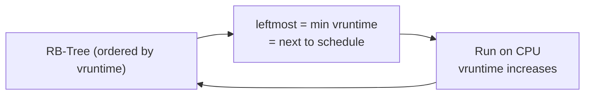

## Question

Explain the Linux CFS scheduler: the virtual runtime concept, how nice values affect scheduling, how it uses a red-black tree, and how cgroups extend it for container CPU quotas.

## Answer

**CFS goal:** Give every runnable process a fair share of CPU time. Unlike O(1) scheduler (timeslice-based), CFS tracks how much CPU time each task has received and always runs the task that has received the least.

**Virtual runtime (vruntime):**

Each task has a `vruntime` counter that increases as it runs on the CPU. The increment is scaled by the task's weight (derived from its nice value):

```
vruntime += real_cpu_time × (weight_of_nice0 / task_weight)
```

A nice -20 task (high priority, heavier weight) accumulates vruntime more slowly → it stays at the front of the queue longer → gets more CPU.

**Red-black tree:** CFS stores runnable tasks in an RB-tree keyed by `vruntime`. The leftmost node (minimum vruntime) is always next to run. O(log n) insert/delete.



**Nice values:** Range from -20 (highest priority, more CPU) to +19 (lowest). `nice -n 10 ./cpu_heavy` runs a task at nice=10. Default is nice=0. Each nice level is ~10% more/less CPU than adjacent level. Use `renice -n 5 -p <pid>` to change dynamically.

**Scheduling latency and min granularity:**
- `sched_latency_ns` (default 6ms on recent kernels): target interval in which every runnable task gets at least one run.
- `sched_min_granularity_ns`: minimum time slice before preemption. Prevents context-switch thrashing with many tasks.

**Cgroups CPU quotas (containers):**
```
# Give container 0.5 CPUs
cpu.cfs_quota_us = 50000
cpu.cfs_period_us = 100000
```
The kernel enforces: this cgroup can only run 50ms per 100ms period. Implemented by throttling the cgroup's tasks when quota is exhausted. Kubernetes `resources.limits.cpu` maps directly to this.

**CPU sets:** `cpuset` cgroup pins a cgroup to specific CPUs — useful for NUMA locality and avoiding cache thrashing.

## Follow-ups

- What is the "sleeper fairness" bonus in CFS and why does it exist?
- How does `isolcpus` kernel parameter work and when would you use it?
- What happens to a container's CPU-bound task when its `cpu.cfs_quota_us` is exhausted mid-second?
