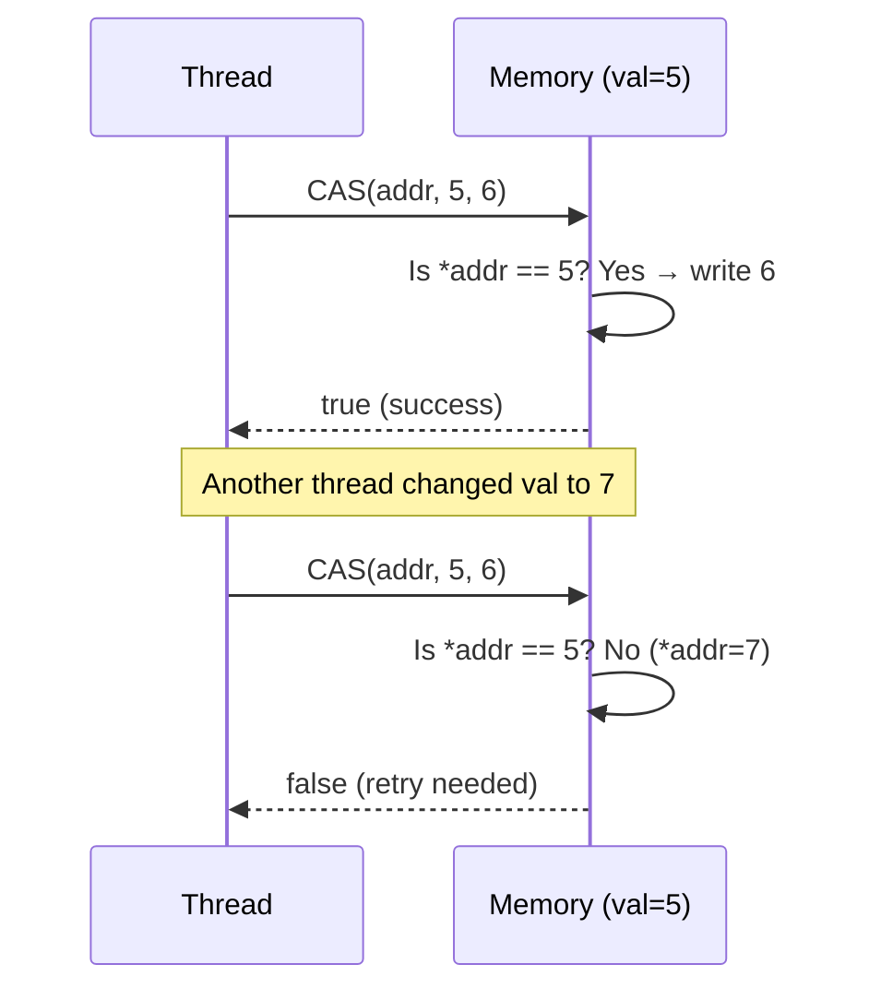

## Question

Explain the CAS hardware primitive, how it enables lock-free data structures, and the ABA problem it introduces. How is ABA solved in practice?

## Answer

**CAS — Compare-And-Swap:**

An atomic hardware instruction: `CAS(address, expected, new_value)` — atomically: if `*address == expected`, set `*address = new_value` and return true. Otherwise return false.



**Lock-free increment pattern:**
```java
AtomicInteger counter = new AtomicInteger(0);

// Under the hood:
int old, newVal;
do {
    old = counter.get();
    newVal = old + 1;
} while (!counter.compareAndSet(old, newVal));
// Retries if another thread changed the value
```

This is **optimistic concurrency** — assume no contention, retry on conflict. Fast when contention is low; degrades with high contention (spinning).

**The ABA Problem:**

1. Thread 1 reads value `A`.
2. Thread 2 changes A → B → A.
3. Thread 1 CAS(A, newVal) **succeeds** — but the value was changed twice. Thread 1 missed the intermediate changes.

**Real-world ABA impact:** In a lock-free linked list, CAS on a node pointer succeeds even though the node was removed and re-added (same pointer, different logical state). Corruption ensues.

**Solutions:**

1. **Tagged pointers (version counter):** Append a monotonically increasing version number to the value. CAS on both value + version. ABA becomes A:v1 → B:v2 → A:v3 — thread 1's CAS(A:v1, new) fails because version changed. Java's `AtomicStampedReference` implements this.

2. **Hazard pointers:** Mark pointers in use before reading; don't free/reuse until no thread holds a hazard pointer to them.

3. **Epoch-based reclamation:** Defer memory reclamation until all threads complete their current epoch. Used in modern lock-free systems.

## Follow-ups

- How does `AtomicStampedReference` in Java prevent the ABA problem?
- What is the difference between CAS and LL/SC (Load-Linked/Store-Conditional) on ARM?
- When does lock-free actually perform worse than locking? (High contention: all threads retry → livelock-like behavior.)
