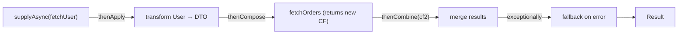

## Question

Walk through Java's `CompletableFuture`: how it differs from `Future`, the key composition methods (`thenApply`, `thenCompose`, `thenCombine`, `exceptionally`), and the thread pool it uses.

## Answer

**`Future<T>` limitations:**
- `get()` blocks — no way to attach a callback.
- No composition — can't chain futures.
- No exception handling in the pipeline.
- Can't complete programmatically.

**`CompletableFuture<T>`** extends `Future` and `CompletionStage` — fully composable, non-blocking callbacks.

**Core operations:**



```java
CompletableFuture<String> result = CompletableFuture
    .supplyAsync(() -> fetchUser(id), executor)      // async start
    .thenApply(user -> user.getName())               // sync transform (same thread)
    .thenCompose(name -> lookupOrders(name))         // async chain (new CF)
    .thenCombine(fetchPreferences(id),               // parallel + merge
                 (orders, prefs) -> merge(orders, prefs))
    .exceptionally(ex -> fallback());                // error recovery
```

**`thenApply` vs `thenCompose`:**
- `thenApply(Function<T, R>)` → maps T to R synchronously. If R is already a CF, you get `CF<CF<R>>` (nested). Wrong for async chains.
- `thenCompose(Function<T, CF<R>>)` → flatMap. Unwraps the inner CF. Correct for chaining async operations.

**Which thread runs callbacks?**

| Method | Thread |
|---|---|
| `thenApply` | Thread that completed the CF (may be calling thread) |
| `thenApplyAsync` | ForkJoinPool.commonPool() or provided executor |
| `thenCompose` | Thread that completed the CF |

Always use `*Async` variants with a custom executor in production — don't block the common pool.

**Error handling:**
```java
.exceptionally(ex -> default_value)    // recover from any error
.handle((result, ex) -> ...)          // always called, can inspect both
.whenComplete((result, ex) -> ...)    // side effect, doesn't transform
```

**Combining multiple futures:**
```java
// Wait for ALL:
CompletableFuture.allOf(cf1, cf2, cf3).thenRun(...)

// First one that completes:
CompletableFuture.anyOf(cf1, cf2, cf3).thenAccept(...)
```

## Follow-ups

- What happens to other futures in `anyOf` that don't win — are they cancelled?
- How do you propagate `MDC` (logging context) across `CompletableFuture` threads?
- Compare `CompletableFuture` to Project Reactor's `Mono` — when would you choose each?
