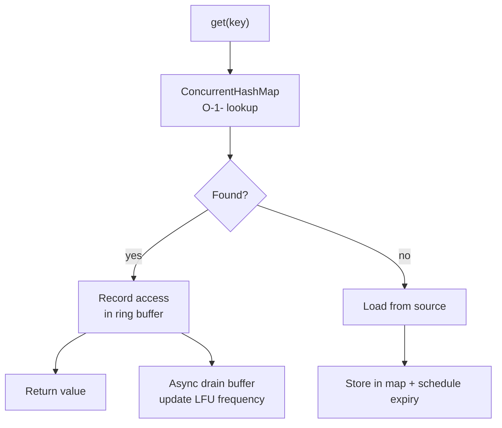

## Question

Design a concurrent in-memory cache with TTL expiration, size limits, and O(1) get/put. Walk through the design choices and explain how Caffeine (the modern Java cache) solves each challenge better than a naive `ConcurrentHashMap + expiry`.

## Answer

**Naive approach problems:**
```java
ConcurrentHashMap<K, V> cache = new ConcurrentHashMap<>();
// Problem 1: No size limit → OOM
// Problem 2: No expiry — stale data forever
// Problem 3: Expensive cleanup — who evicts? When?
```

**Requirements for a production cache:**
- Thread-safe reads/writes.
- TTL (time-to-live) expiry.
- Max size + eviction policy (LRU/LFU).
- Low overhead — cache shouldn't be the bottleneck.

**Caffeine's design (state of the art):**



**Key Caffeine innovations:**

1. **Window TinyLFU eviction:** Combines LRU window (for new items) + LFU frequency sketch (for popular items). Better hit rate than pure LRU.

2. **Lock-free read path:** Reads don't acquire any lock. Access records go into a per-thread ring buffer (striped); a single background thread drains buffers and updates frequency counts.

3. **Timer wheel for expiry:** Efficient O(1) expiry scheduling using a hierarchical timer wheel — better than a sorted set (O(log n)) or scheduled executor per entry.

4. **Write batching:** Writes go to a bounded MPSC (Multi-Producer Single-Consumer) queue. The maintenance thread processes evictions and expiries in batch.

**Simple Caffeine usage:**
```java
Cache<String, User> cache = Caffeine.newBuilder()
    .maximumSize(10_000)
    .expireAfterWrite(5, TimeUnit.MINUTES)
    .recordStats()
    .build();

User user = cache.get(id, this::loadFromDB);
```

**TTL implementation choices:**
- **Expire after write:** Starts on put — good for data with fixed freshness.
- **Expire after access:** Resets on read — good for sessions.
- **Refresh after write:** Background refresh on stale reads — reduces latency spike on cache miss.

## Follow-ups

- How does Caffeine's `refreshAfterWrite` differ from `expireAfterWrite`?
- What is W-TinyLFU and how does it achieve higher hit rates than LRU?
- How would you implement a distributed version of this cache? (Redis + local L1 cache with invalidation events.)
