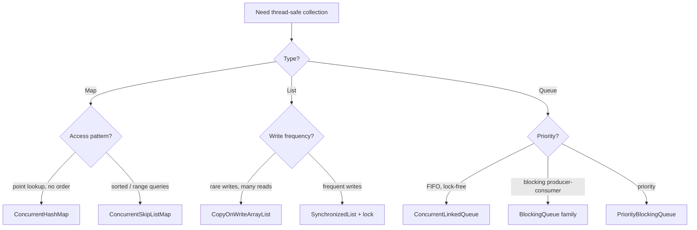

## Question

Map out the Java concurrent collection landscape: `ConcurrentHashMap`, `CopyOnWriteArrayList`, `ConcurrentSkipListMap`, `ConcurrentLinkedQueue`. When do you use each, and what are the consistency and performance tradeoffs?

## Answer

**Overview:**

**`ConcurrentHashMap`:**
- O(1) average get/put. Bin-level locking for writes. Lock-free reads.
- No null keys/values (null means "not present").
- `size()` is approximate under concurrent modification.
- `computeIfAbsent(key, fn)` atomically computes and inserts — eliminates check-then-act races.
- **Use:** Default map for all concurrent scenarios.

**`ConcurrentSkipListMap`:**
- O(log n) for all operations. Lock-free using CAS.
- Maintains sorted order (like `TreeMap`). Supports `headMap`, `tailMap`, `floorKey`, `ceilingKey`.
- Thread-safe range queries via sub-map views.
- **Use:** When you need sorted concurrent access (leaderboards, event timelines).

**`CopyOnWriteArrayList`:**
- Writes create a new array copy; reads use the old copy (snapshot semantics).
- Zero lock on reads — excellent read performance.
- Expensive writes: O(n) copy for every add/remove.
- Iterator never throws `ConcurrentModificationException`.
- **Use:** Event listener lists, rarely-changing observer lists.

**`ConcurrentLinkedQueue`:**
- Lock-free FIFO queue (Michael-Scott algorithm).
- `size()` is O(n) — avoid calling it.
- Non-blocking: `poll()` returns null if empty (never blocks).
- **Use:** High-throughput task queues without blocking semantics.

**`Collections.synchronizedXxx`:** Wraps any collection with a single mutex. Entire collection locked per operation. Simple but low concurrency. Iterator must be externally synchronized.

**Consistency model:** All concurrent collections provide weakly consistent iterators — they may or may not reflect modifications made after iterator creation. They never throw `ConcurrentModificationException`.

## Follow-ups

- Why does `ConcurrentHashMap.putIfAbsent` vs `computeIfAbsent` matter for check-then-act atomicity?
- When would you use `Collections.synchronizedMap` over `ConcurrentHashMap`?
- How does `ConcurrentSkipListMap` achieve O(log n) lock-free operations?
