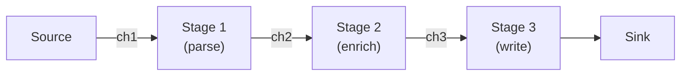

## Question

Design a concurrent data processing pipeline with multiple stages, each with different throughputs. Describe the patterns: pipeline, fan-out, fan-in, and how to handle backpressure. Use Go channels or Java BlockingQueue as the implementation substrate.

## Answer

**Pipeline pattern:** Each stage reads from an input channel, processes, writes to an output channel. Stages run in parallel — while stage 2 processes item N, stage 1 processes item N+1.



**Go implementation:**
```go
func pipeline(source <-chan []byte) <-chan Result {
    parsed := parseStage(source)    // goroutine reads source, writes parsed
    enriched := enrichStage(parsed) // goroutine reads parsed, writes enriched
    return writeStage(enriched)     // goroutine reads enriched, writes results
}
```

**Fan-out (distribute work):** One producer, N consumers. Useful when one stage is slower than upstream.

```go
func fanOut(input <-chan Item, workers int) []<-chan Result {
    outputs := make([]<-chan Result, workers)
    for i := range workers {
        outputs[i] = worker(input)   // all read from same input channel
    }
    return outputs
}
```

**Fan-in (merge results):** N producers, one consumer.

```go
func fanIn(inputs ...<-chan Result) <-chan Result {
    merged := make(chan Result)
    var wg sync.WaitGroup
    for _, ch := range inputs {
        wg.Add(1)
        go func(c <-chan Result) {
            defer wg.Done()
            for v := range c { merged <- v }
        }(ch)
    }
    go func() { wg.Wait(); close(merged) }()
    return merged
}
```

**Backpressure:** Buffered channels provide a bounded buffer. When the buffer fills, the upstream stage blocks — this is backpressure propagating upstream.

```
Stage 1 → [buffer=10] → Stage 2 (slow)
When buffer full: Stage 1 blocks → signals to slow down
```

**Bottleneck identification:** The slowest stage determines throughput. Add parallel workers to slow stages (fan-out). Make buffers large enough to smooth bursts but bounded to prevent OOM.

**Cancellation:** Use `context.Context` — pass to each stage; check `ctx.Done()`. When cancelled, all stages drain their buffers and exit.

**Java equivalent:** Use `BlockingQueue` between stages (LinkedBlockingQueue with capacity). Each stage is a thread pool of workers reading/writing from queues.

## Follow-ups

- How does the Reactive Streams `Flux.parallel()` operator implement fan-out in Project Reactor?
- What is the optimal buffer size between pipeline stages? (Experiment; rule of thumb: buffer = throughput × average latency per item × safety factor.)
- How do you propagate errors from one pipeline stage to all downstream stages?
