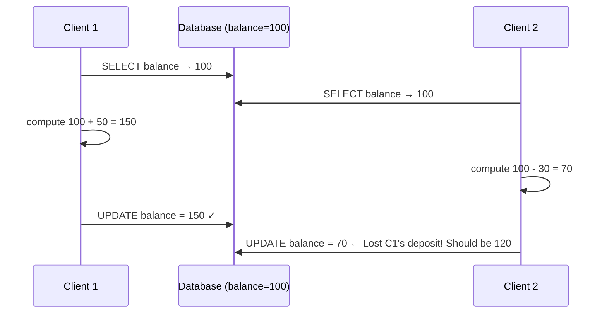

## Question

Two HTTP requests arrive simultaneously to update the same user record. Walk through the lost update problem, how version columns solve it, how ETags apply in REST APIs, and what write skew is.

## Answer

**The lost update problem:**



**Solution 1 — Optimistic version column:**
```sql
SELECT balance, version FROM accounts WHERE id = 1;
-- application computes new_balance
UPDATE accounts
SET balance = new_balance, version = version + 1
WHERE id = 1 AND version = :read_version;  -- conflict guard
-- if rows_affected = 0: conflict, retry
```

**Solution 2 — Pessimistic `SELECT FOR UPDATE`:**
```sql
BEGIN;
SELECT balance FROM accounts WHERE id = 1 FOR UPDATE;  -- row-level lock
-- compute new_balance
UPDATE accounts SET balance = new_balance WHERE id = 1;
COMMIT;
```
Prevents concurrent reads by locking the row. No retry needed but reduces concurrency.

**ETag in REST APIs:**
```
GET /users/123
→ Response: ETag: "v5" + body

PUT /users/123
→ Request: If-Match: "v5"
→ Server checks: if current version != "v5" → 412 Precondition Failed
→ Client must GET fresh copy and retry
```

**Write skew (more subtle than lost update):**

Two transactions both read overlapping data, each makes a decision based on the read, then each writes non-overlapping data — but combined, the result violates a constraint:

```
T1: Read: Alice on-call=true, Bob on-call=true → both on call → safe to remove Alice
T2: Read: Alice on-call=true, Bob on-call=true → both on call → safe to remove Bob
T1: UPDATE alice.oncall = false
T2: UPDATE bob.oncall = false
Result: nobody on call! Violates "at least one person on call" invariant
```

Write skew requires **Serializable** isolation (or explicit `SELECT FOR UPDATE` to lock the invariant's rows). Snapshot isolation (MVCC) does NOT prevent write skew.

## Follow-ups

- What database isolation level prevents write skew? (Serializable — e.g., PostgreSQL's SSI.)
- How does optimistic concurrency relate to MVCC in PostgreSQL?
- How would you implement the "at least one on-call" invariant without serializable isolation?
