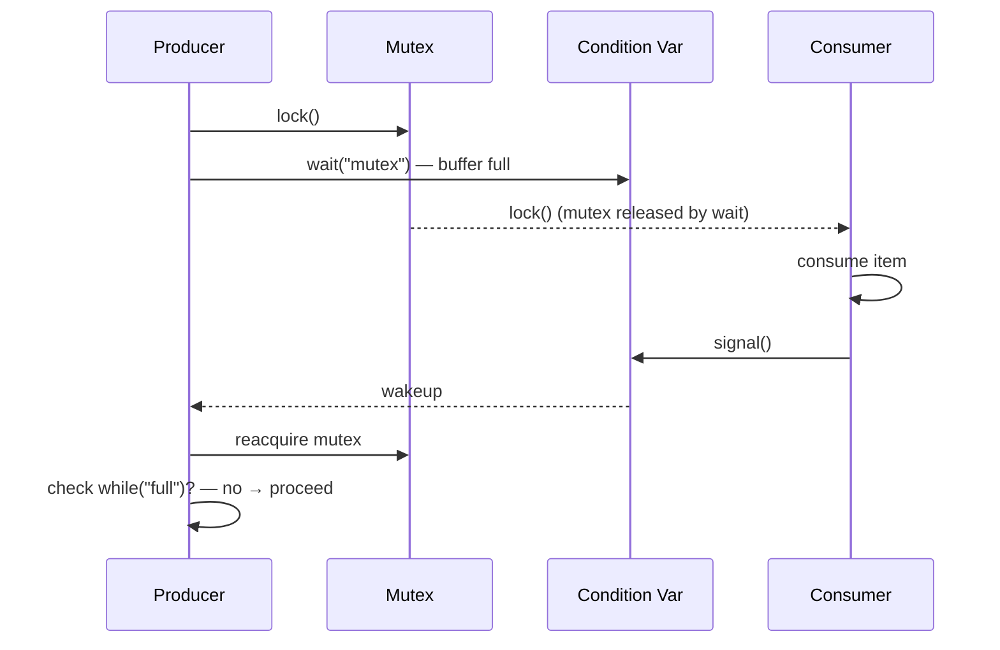

## Question

Explain condition variables: the wait/signal/broadcast operations, why you must always check the condition in a loop (not just an `if`), and the producer-consumer pattern they enable.

## Answer

**Condition variable:** A synchronization primitive that lets a thread wait until a certain condition becomes true, without busy-waiting. Always used together with a mutex.

**Operations:**
- `wait(cv, mutex)` — atomically releases the mutex and suspends the thread. When woken, reacquires the mutex before returning.
- `signal(cv)` — wakes one waiting thread.
- `broadcast(cv)` — wakes all waiting threads.

**Producer-consumer with condition variable:**

```python
mutex = Mutex()
cv = ConditionVariable()
buffer = []
MAX = 10

# Producer
with mutex:
    while len(buffer) == MAX:     # MUST be while, not if
        cv.wait(mutex)            # releases lock, sleeps
    buffer.append(item)
    cv.signal()

# Consumer
with mutex:
    while len(buffer) == 0:       # MUST be while, not if
        cv.wait(mutex)
    item = buffer.pop()
    cv.signal()
```



**Why `while` not `if` (spurious wakeups):**

POSIX explicitly allows `wait()` to return **without being signalled** — a spurious wakeup. This can happen due to OS signal delivery, hardware interrupts, or implementation details.

If you use `if`, after a spurious wakeup, the thread proceeds without verifying the condition is actually true — leading to incorrect behavior (consuming from an empty buffer).

**`while` protects against:**
1. Spurious wakeups.
2. Multiple waiters: if two threads are waiting and one signals, both wake (with `broadcast`). Only one will find the condition true; the other must re-wait.
3. Another thread stealing the condition between signal and wakeup.

**Java equivalent:** `synchronized` + `wait()`/`notify()`/`notifyAll()`. Or `Lock` + `Condition.await()`/`signal()`.

## Follow-ups

- Why does `wait()` atomically release the mutex? What would go wrong if it released first, then slept?
- What's the difference between `notify()` and `notifyAll()` in Java, and which is safer?
- How do condition variables differ from semaphores in the producer-consumer pattern?
