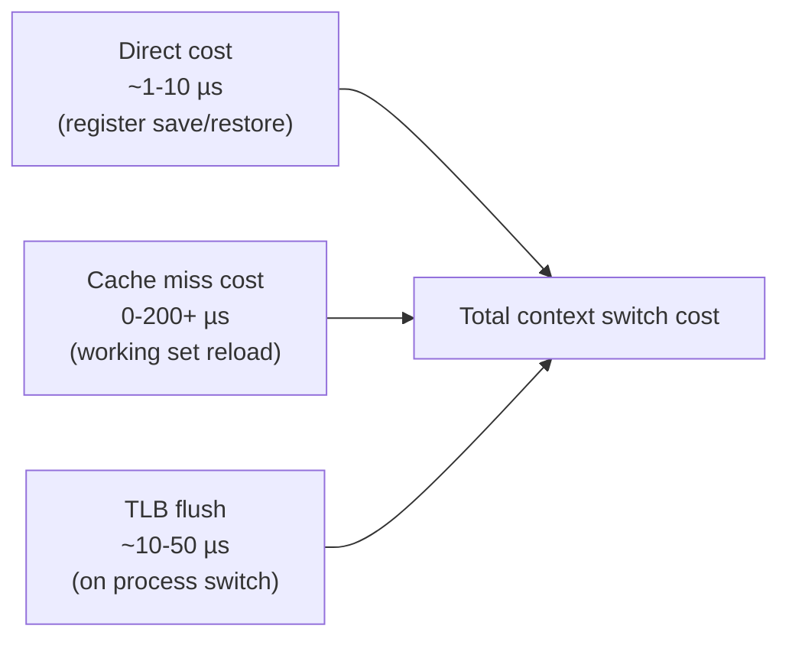

## Question

Quantify context switch overhead: what the kernel must save/restore, what indirect costs exist (cache eviction, TLB flush, pipeline flush), and how to measure it. When does high context-switch rate indicate a problem?

## Answer

**Direct cost of a context switch (what the kernel does):**

1. Save current thread's CPU registers (general purpose + FP/SIMD state if used).
2. Save the current thread's kernel stack pointer.
3. Load the new thread's registers and stack pointer.
4. Optionally: update page table base register (`CR3`) if switching processes (not just threads within same process) → TLB flush on non-PCID systems.

**Raw kernel overhead:** 1-10 µs on modern hardware. But the *indirect* cost often dominates.

**Indirect costs:**

1. **Cache eviction:** The new thread's working set evicts the old thread's cache lines. On a warm L1/L2 cache with 256KB working set, cache reloading can cost hundreds of µs in extra memory latency.

2. **TLB flush:** When switching between processes (different virtual address spaces), all TLB entries for the old process are invalidated (unless PCID — Process-Context Identifiers are used to tag entries). TLB refill costs: 1 miss = ~200 cycles.

3. **Branch predictor pollution:** CPU branch prediction history is now wrong for the new thread.

4. **Pipeline flush:** In-flight speculative instructions are discarded.



**Measurement:**
```bash
# Count context switches for a process
pidstat -w 1   # voluntary (cs) and involuntary (nvcswch) context switches
# System-wide
vmstat 1       # cs column

# Micro-benchmark
perf stat -e context-switches,sched:sched_switch ./program
```

**When is high context-switch rate a problem?**
- **Thread pool thrashing:** Too many threads blocked on I/O + many CPU-bound threads → high voluntary + involuntary switches.
- **Lock contention:** Threads frequently blocking and waking → many voluntary switches.
- **Excessive interrupts:** High interrupt rate causes frequent kernel mode switches.
- **Symptom:** High `cs` in `vmstat`, high `%sys` in `top`, latency spikes.

**Solutions:** Reduce threads (use async I/O), reduce lock contention, use CPU affinity (`taskset`) to improve cache locality.

## Follow-ups

- What is a voluntary vs involuntary context switch, and how does each happen?
- How does PCID (Process-Context Identifiers) avoid TLB flushes on process switches?
- What is the "cost" of using `goroutines` vs OS threads in terms of context switches?
