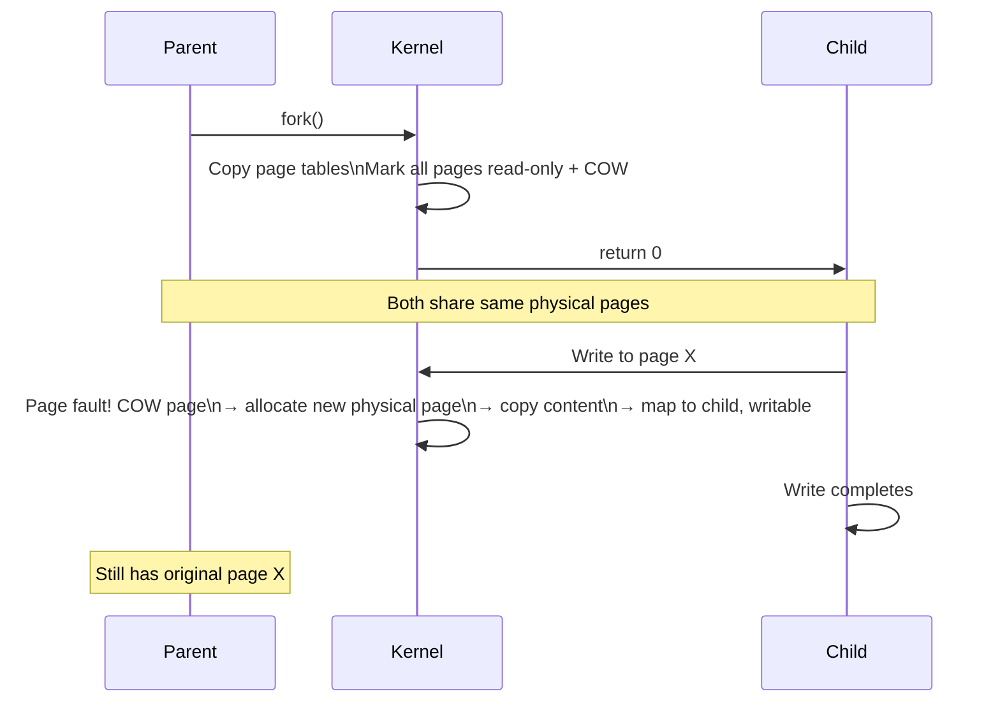

## Question

Explain Copy-on-Write (CoW) as used by Linux `fork()`: how the child process initially shares parent pages, what triggers a copy, and the implications for memory usage and `fork()`+`exec()` performance.

## Answer

**Without CoW:** `fork()` would need to copy the entire parent address space (code, heap, stack, mmap regions) before the child runs. For a 4GB process, that's 4GB of memory copy + millions of page table entries — too slow.

**With CoW:** `fork()` copies only the page table, marking all pages as read-only and shared. Physical pages are shared between parent and child.

**What gets copied immediately in `fork()`:**
- Page table entries (lightweight — 8 bytes per 4KB page).
- File descriptor table (reference counts incremented).
- Signal handlers, working directory, umask.
- Stack memory (but CoW — actual pages shared until written).

**`fork()` + `exec()` (the vfork optimization):**
When `fork()` is followed immediately by `exec()`, CoW pages are never actually copied — `exec()` replaces the address space entirely. `vfork()` is an older optimization for this: child borrows parent's address space and stack — parent is suspended until child calls `exec()`.

**Redis `BGSAVE` and CoW:**
Redis `fork()`s a child to write a snapshot. Parent continues serving requests. Each write by the parent triggers a CoW page copy. If write rate is high during snapshot, memory usage nearly doubles (parent + child each hold modified pages). Monitor with `INFO memory` → `rdb_changes_since_last_save`.

**`mmap` regions:** `MAP_PRIVATE` mmap'd regions are also CoW — writes create private copies per process. `MAP_SHARED` regions are NOT CoW — all processes share and see each other's writes.

## Follow-ups

- What is `MADV_DONTFORK` and when would you use it to prevent a child from inheriting a mmap region?
- How does Kubernetes use `clone()` with `CLONE_*` flags instead of `fork()` to create containers?
- What is the THP (Transparent Huge Pages) interaction with CoW — why can a single 2MB huge page write cause a 2MB copy?
