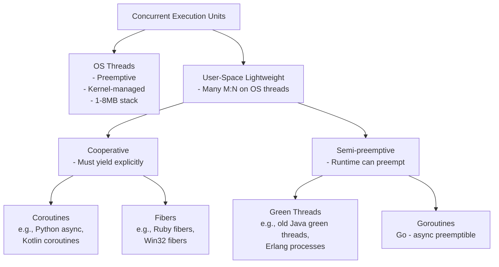

## Question

Clarify the terminology: coroutines, fibers, green threads, and user-space threads. What do they share, how do they differ in scheduling model, and which languages/runtimes implement each?

## Answer

**Taxonomy:**

**Coroutines:** Execution contexts that voluntarily suspend at defined points (`yield`, `await`). Caller and coroutine take turns on the same thread. No parallelism without combining with threads. Stateful resumable functions.

**Fibers:** Similar to coroutines but more general — explicitly scheduled user-space threads. The application controls scheduling. No parallelism (single-threaded). Ruby `Fiber`, Windows fibers, `io_uring` fibers.

**Green threads:** User-space threads scheduled by the language runtime instead of the OS. M:N mapping. Early Java (1.x green threads, removed in 1.3). Erlang "processes" (green threads with preemption). Go goroutines are a modern green thread variant with async preemption.

**Key differences:**

| | OS Thread | Coroutine | Fiber | Goroutine |
|---|---|---|---|---|
| Scheduling | OS (preemptive) | Application (cooperative) | Application (cooperative) | Runtime (semi-preemptive) |
| Stack size | 1-8 MB | Variable (heap-allocated frames) | Kilobytes | 2 KB (grows) |
| Parallelism | Yes (multi-core) | No (unless threaded) | No | Yes (GOMAXPROCS) |
| Context switch | Kernel (~µs) | User-space (<1µs) | User-space (<1µs) | User-space (~100ns) |

**Java virtual threads (Project Loom):** Closest to goroutines for the JVM — user-space, JVM-scheduled, blocking operations unmount from carrier thread. Both parallel (multiple carrier threads) and concurrent.

**Practical choice:**
- High I/O concurrency, sequential code style → goroutines / virtual threads.
- Explicit generator-style control flow → coroutines (Python `async def`, Kotlin `suspend`).
- CPU-bound parallel computation → OS threads.

## Follow-ups

- Why did Go switch from cooperative to semi-preemptive goroutine scheduling in Go 1.14?
- How does Python's `generator` differ from Python's `async` coroutine?
- What is the "colored functions" problem with coroutines, and how does Go avoid it?
