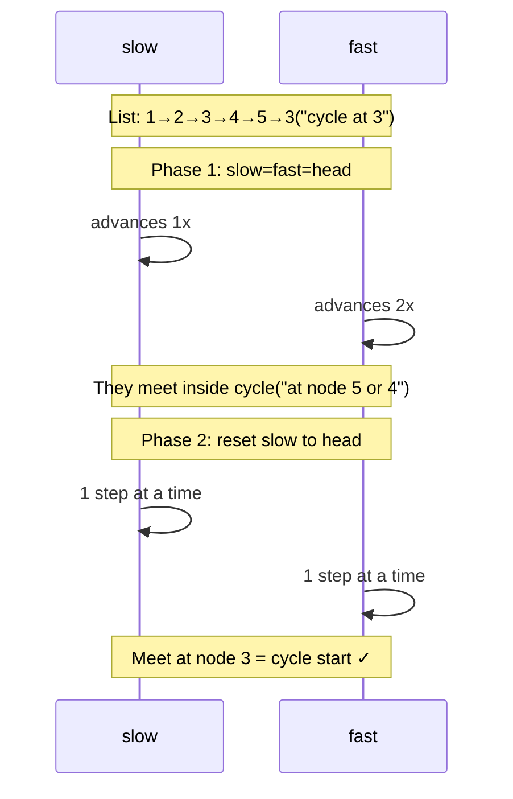

## Question

Given a linked list that may contain a cycle, detect whether a cycle exists and, if it does, find the node where the cycle begins. Achieve O(n) time and O(1) space.

## Answer

**Phase 1 — Detect (Floyd's algorithm):**

Use two pointers: slow advances 1 step, fast advances 2 steps. If they ever meet, there's a cycle. If fast reaches null, no cycle.

```
slow = fast = head
while fast and fast.next:
    slow = slow.next
    fast = fast.next.next
    if slow == fast:
        # cycle detected, go to phase 2
```

**Phase 2 — Find cycle start:**

After detection, reset one pointer to `head`. Move both pointers one step at a time. Where they meet is the cycle start.



**Why phase 2 works (math):**

Let `F` = distance from head to cycle start, `C` = cycle length, `k` = where they meet inside cycle.

When they meet: slow has traveled `F + k`, fast has traveled `F + k + n·C` for some n. Since fast = 2·slow: `F + k = n·C` → `F = n·C - k`.

So from the meeting point, traveling `F` more steps lands you at the cycle start — which is exactly where head + F steps ends up too.

**O(1) space:** No visited-set needed. Hash set approach is O(n) space — fine for interviews if you state the tradeoff.

**Variation — find cycle length:** After phase 1 meeting, keep slow still, advance fast until it meets slow again, count steps.

## Follow-ups

- Detect a cycle in a **directed graph** (not linked list) — DFS with three-color marking.
- Find a duplicate number in an array of values 1..n using Floyd's algorithm (treat `arr[i]` as "next pointer").
- What's the maximum number of steps before slow and fast must meet?
