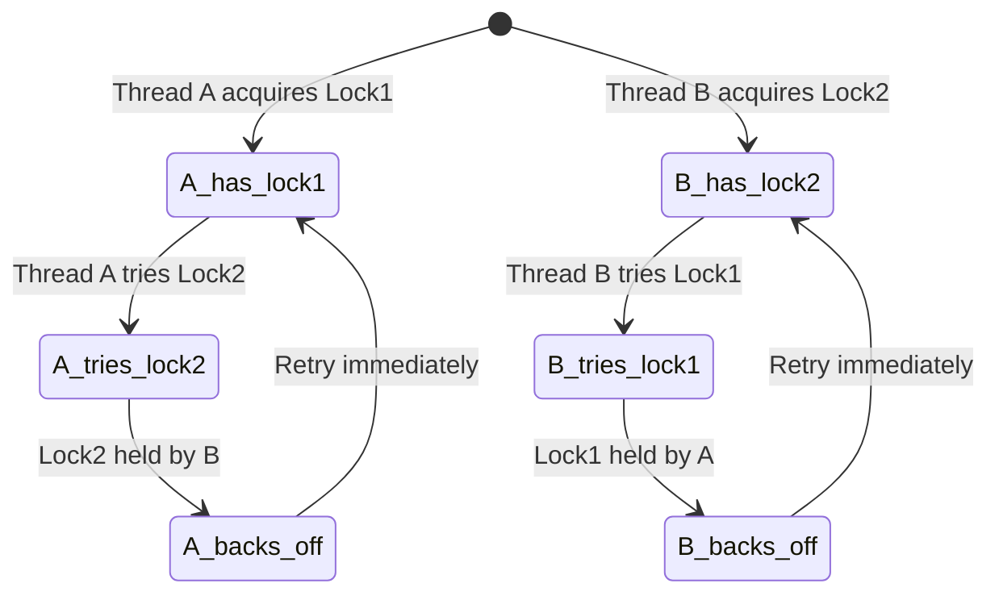

## Question

Distinguish deadlock, livelock, and starvation. Give a concrete scenario for each and explain what prevention or detection strategy applies to each.

## Answer

**Deadlock:** Threads are permanently blocked, each waiting for a resource held by another. No progress is possible. The system is stuck.

*Example:* Thread A holds Lock 1, waits for Lock 2. Thread B holds Lock 2, waits for Lock 1. Circular wait — Coffman condition 4.

**Livelock:** Threads are not blocked but make no useful progress. They keep reacting to each other, changing state, but never completing.

*Example:* Two people in a hallway politely stepping aside for each other — they both step to the same side, step back, step again, indefinitely. In code: two threads detect a lock conflict and both back off simultaneously, then both retry at the same time, forever.

**Starvation:** One or more threads are perpetually denied access to a resource because others keep getting priority. The starved threads are ready to run but never scheduled.

*Example:* A lock with no fairness guarantee. High-priority threads constantly acquire the lock; a low-priority thread waits indefinitely.

**Comparison:**

| | Progress | Threads active? | CPU used? |
|---|---|---|---|
| Deadlock | None | No (blocked) | No |
| Livelock | None | Yes (spinning) | Yes (wasted) |
| Starvation | Others progress | Yes (waiting) | Others use it |

**Solutions:**

- **Deadlock:** Lock ordering, timeout + retry, banker's algorithm, deadlock detection + victim selection.
- **Livelock:** Random backoff with jitter (exponential backoff — same solution as Ethernet collision avoidance).
- **Starvation:** Fair locks (queue-based, e.g., `ReentrantLock(true)` in Java), priority aging (gradually increase priority of waiting threads).

## Follow-ups

- How does Java's `ReentrantLock` support fairness, and what is the cost of fair locking?
- Describe exponential backoff with jitter — why is pure exponential backoff still not enough?
- How does a database detect deadlock between transactions (wait-for graph)?
