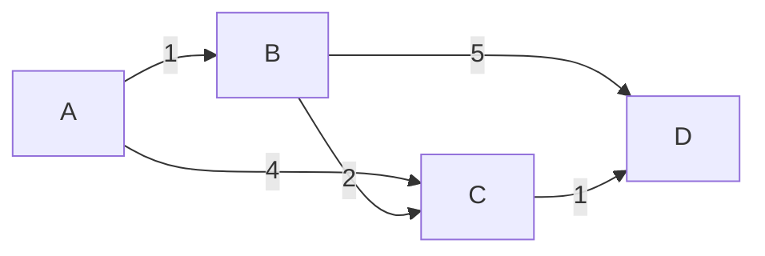

## Question

Walk through Dijkstra's shortest path algorithm. What invariant does it maintain, why doesn't it work with negative edges, and how does the choice of data structure change its complexity?

## Answer

**Invariant:** Once a node is finalized ("settled"), its shortest distance is known and will never decrease.

**Algorithm:**
1. Initialize `dist[source] = 0`, all others = ∞.
2. Insert all nodes into a min-priority queue keyed by `dist`.
3. While queue not empty:
   - Extract the node `u` with minimum distance.
   - For each neighbor `v` of `u`: if `dist[u] + weight(u,v) < dist[v]`, update `dist[v]` and decrease key in queue.

Shortest paths from A: B=1, C=3 (A→B→C), D=4 (A→B→C→D).

**Complexity by data structure:**

| Priority Queue | `Extract-Min` | `Decrease-Key` | Total |
|---|---|---|---|
| Array (linear scan) | O(V) | O(1) | **O(V²)** |
| Binary heap | O(log V) | O(log V) | **O((V+E) log V)** |
| Fibonacci heap | O(log V) amort. | O(1) amort. | **O(E + V log V)** |

For **dense graphs** (E ≈ V²): array wins. For **sparse graphs** (E ≈ V): binary heap wins. Fibonacci heap is theoretical best but complex.

**Why negative edges break it:** Once a node is settled, Dijkstra never revisits it. A negative edge to a settled node could reduce its distance — Dijkstra misses this.

**Fix for negative edges:** Use Bellman-Ford (O(VE)) or, for DAGs, relax edges in topological order.

**Lazy deletion variant:** Instead of `decrease-key`, push duplicate (dist, node) entries. On extract, skip if already settled. Simpler to implement; O((E + V) log E) — almost the same in practice.

## Follow-ups

- How does A* improve on Dijkstra using a heuristic?
- What is Bidirectional Dijkstra and when does it help?
- Compare Dijkstra vs Bellman-Ford vs SPFA for different graph types.
