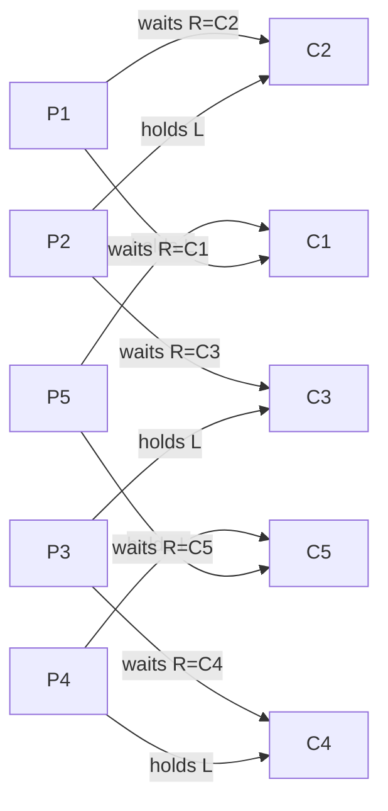

## Question

Describe the Dining Philosophers problem, show why the naive solution deadlocks, then walk through three solutions: resource ordering, arbitrator, and Chandy/Misra (message-passing).

## Answer

**Problem setup:** 5 philosophers sit at a round table. Between each pair is one chopstick (fork). A philosopher either thinks or eats. To eat, they need BOTH their left and right chopstick.

**Naive solution (deadlocks):**
```python
while True:
    pick_up_left_chopstick()
    pick_up_right_chopstick()  # ← all philosophers reach here simultaneously → deadlock
    eat()
    put_down_both()
    think()
```
If all 5 simultaneously pick up their left, nobody can get their right → circular wait → deadlock.



**Solution 1 — Resource ordering:** Number chopsticks 1-5. Always pick up the lower-numbered one first. The highest-numbered chopstick (5) can never be the "last to be picked up before someone else needs it" in the cycle. Breaks circular wait.

```python
left, right = min(i, (i+1)%5), max(i, (i+1)%5)
pick_up(left); pick_up(right)
```

**Solution 2 — Arbitrator (waiter):** A mutex-protected waiter allows only 4 philosophers to sit at once. With max 4 holding chopsticks, at least one can always complete.

```python
semaphore = Semaphore(4)
semaphore.acquire()
pick_up_left(); pick_up_right(); eat(); put_down()
semaphore.release()
```

**Solution 3 — Chandy/Misra (token passing):** Chopsticks are passed as messages. A hungry philosopher requests neighbors' chopsticks. A chopstick is "clean" when unused and "dirty" after use. A philosopher always gives up a dirty chopstick when asked. Provably starvation-free.

**Real-world relevance:** Resource ordering is the practical solution used in databases (acquiring locks in a canonical order to prevent deadlock), OS page fault handlers, and distributed systems.

## Follow-ups

- Which of the four Coffman conditions does each solution break?
- How does PostgreSQL prevent deadlock in multi-row locking? (Abort one transaction — the victim — and retry.)
- The dining philosophers problem is theoretical. Name a real production deadlock scenario with the same structure.
