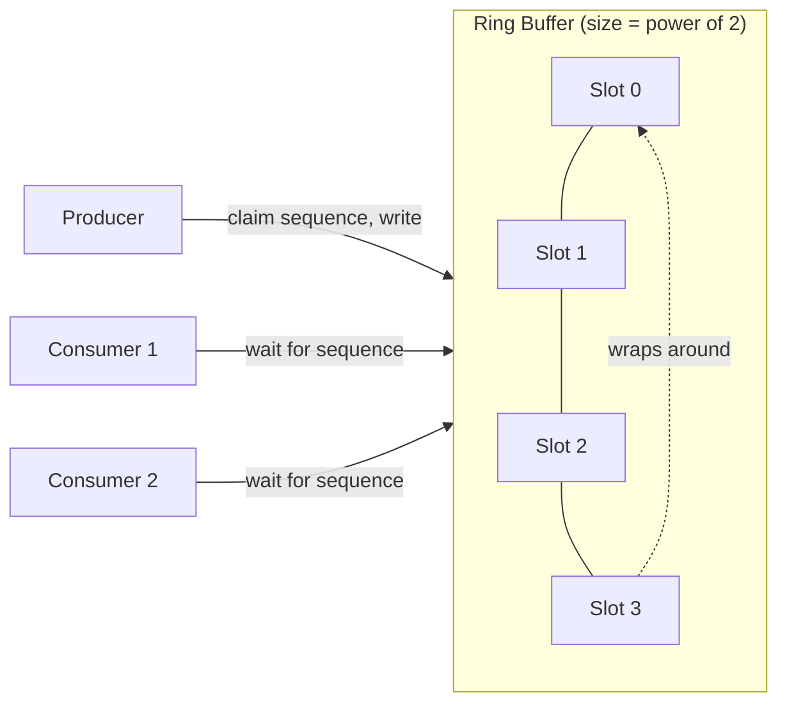

## Question

Explain the LMAX Disruptor pattern: why it dramatically outperforms `ArrayBlockingQueue`, the ring buffer design, sequence numbers, and the memory-layout tricks that exploit CPU cache behavior.

## Answer

**What the Disruptor is:** A high-performance inter-thread messaging library that replaces queues. Used by LMAX Exchange for 6 million transactions/second on a single thread.

**Why `ArrayBlockingQueue` is slow:**
1. Uses a `ReentrantLock` with `Condition` — lots of CAS + lock overhead.
2. Head and tail are in the same cache line → false sharing between producer and consumer.
3. Queue nodes are heap objects → GC pressure.
4. `put`/`take` involve `System.nanoTime()` for timeout → costly.

**Disruptor design:**



**Key design choices:**

1. **Ring buffer (power of 2 size):** `index = sequence & (size-1)` — fast modulo without division. No node allocation; pre-allocated slots.

2. **Sequence numbers instead of head/tail pointers:** Producer claims a sequence, consumers track how far they've read. No enqueue/dequeue — just advance sequences.

3. **Mechanical sympathy — padding:**
   ```java
   // Sequence with padding to prevent false sharing
   class Sequence {
       long p1, p2, p3, p4, p5, p6, p7;  // pre-padding
       volatile long value;
       long p9, p10, p11, p12, p13, p14, p15;  // post-padding
   }
   ```
   Producer sequence, consumer sequence, and ring buffer entries each occupy their own cache lines.

4. **Wait strategies:**
   - **BusySpin:** Spin on sequence check — lowest latency, highest CPU.
   - **Yielding:** `Thread.yield()` — balanced.
   - **Blocking:** Use condition variable — lowest CPU, highest latency.

5. **Multiple consumers without coordination:** Each consumer has its own sequence. The ring buffer slot is only overwritten when ALL consumers have processed it.

**Performance:** 25M+ operations/second on modern hardware vs ~5M for `ArrayBlockingQueue`.

**When to use Disruptor:**
- Ultra-low latency event processing (trading, telemetry).
- Many consumers of the same event stream (pub-sub).
- When profiling shows lock contention in your queue is the bottleneck.

## Follow-ups

- How does the Disruptor handle multiple producers? (Each CAS-claims a unique sequence.)
- What is "mechanical sympathy" and how does Martin Thompson define it?
- How does event sourcing map naturally to the Disruptor's sequential append model?
