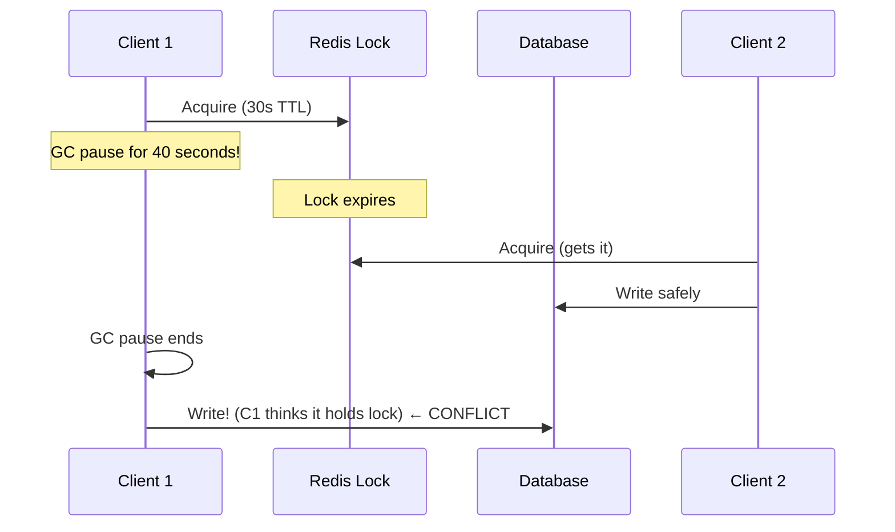

## Question

Explain distributed locks: why in-process mutexes don't work across nodes, how to implement a basic Redis-based lock, what the Redlock algorithm attempts, and why Martin Kleppmann argues even Redlock is unsafe without fencing tokens.

## Answer

**Why distributed locks are needed:** In a multi-node service, a plain mutex only protects within one process. Across nodes (e.g., cron job running on multiple instances), you need a shared lock.

**Basic Redis lock:**
```
SET lock_key <unique_id> NX PX 30000
```
- `NX` — set only if not exists (atomic acquisition).
- `PX 30000` — expire in 30 seconds (lease-based, prevents lock held forever if holder crashes).

**Unlock (must use Lua for atomicity):**
```lua
if redis.call("GET", KEYS[1]) == ARGV[1] then
    return redis.call("DEL", KEYS[1])
else
    return 0
end
```
The `unique_id` check prevents deleting another client's lock if your lease expired.

**Redlock algorithm (Martin Kleppmann's critique):**
Acquire lock on N/2+1 of N Redis masters in sequence. If acquired majority within validity time, you hold the lock.

**Problem (Kleppmann):**


GC pauses, process pauses, clock skew — any of these can cause a client to act after its lock expired, violating mutual exclusion.

**Fencing tokens (correct solution):**
- Lock service returns a monotonically increasing token on each acquisition.
- Client passes token to the resource (DB, API).
- Resource rejects requests with tokens older than the last seen.
- Works even if client pauses after acquiring the lock.

**When to use distributed locks:**
- Idempotent with retries + idempotency keys is often better.
- Cron job deduplication (leader election).
- Short, bounded critical sections with low pause risk.
- **Avoid for correctness-critical paths** — use database transactions or optimistic locking instead.

## Follow-ups

- How does ZooKeeper's ephemeral sequential node implement a distributed lock?
- What is a "lease" vs a "lock" in distributed systems?
- How does etcd's `Grant + Put + KeepAlive` model a distributed lock?
