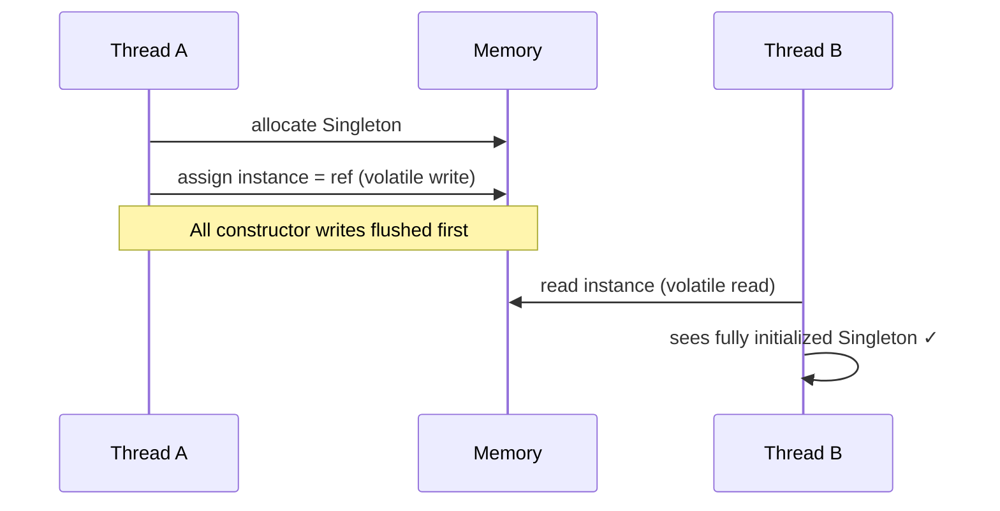

## Question

Explain double-checked locking (DCL): what problem it optimizes, why the naive version is broken on modern JVMs, and exactly which reordering makes `volatile` necessary.

## Answer

**Goal:** Lazy initialization with minimal synchronization. Only synchronize on the first access (creation); subsequent reads are lock-free.

**Naive broken DCL:**
```java
private static Singleton instance;

public static Singleton getInstance() {
    if (instance == null) {            // Check 1 — no lock
        synchronized (Singleton.class) {
            if (instance == null) {    // Check 2 — with lock
                instance = new Singleton();
            }
        }
    }
    return instance;
}
```

**Why it's broken:** `instance = new Singleton()` compiles to three steps:
1. Allocate memory.
2. Initialize fields (`new Singleton()` executes constructor).
3. Assign reference to `instance`.

The JVM/CPU can reorder steps 2 and 3:
```
1. Allocate memory
3. Assign reference to instance  ← Thread B sees non-null!
2. Initialize fields              ← But fields not yet set
```

Thread B checks `instance != null` (Check 1), returns the reference, and tries to use partially constructed object. Crash or silent corruption.

**Fix — `volatile`:**
```java
private static volatile Singleton instance;
```

`volatile` prevents reordering: the write to `instance` happens-after all writes inside the constructor. Thread B, reading through a volatile, sees a fully initialized object.

**Why `volatile` works here:**
- Volatile write: creates a happens-before edge from all constructor writes to the volatile write.
- Volatile read: Thread B's read of `instance` sees all actions that happened-before the volatile write — including constructor execution.

**Better alternative — initialization-on-demand holder:**
```java
private static class Holder {
    static final Singleton INSTANCE = new Singleton();
}
public static Singleton getInstance() { return Holder.INSTANCE; }
```
No `volatile` needed. Java class loader guarantees thread-safe static initialization. Zero synchronization cost on the hot path.



## Follow-ups

- Why was DCL considered "broken" in Java 1.4 but fixed in Java 5 with the updated JMM?
- Does DCL work correctly in C++ with `std::atomic<T*>`?
- What makes the holder pattern immune to the reordering problem?
