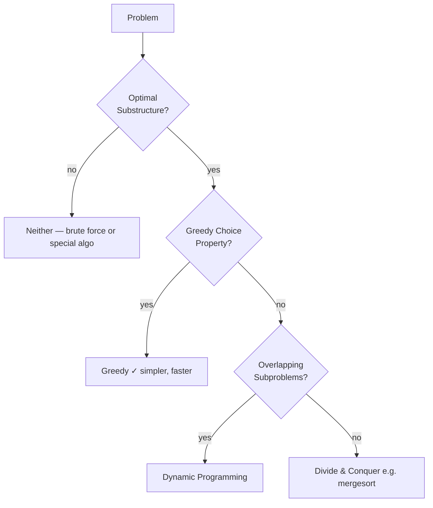

## Question

Many problems look like they should be greedy but require DP. Explain the formal conditions under which greedy is correct, and contrast with the conditions for DP. Use coin change as a concrete example showing where greedy fails.

## Answer

**Two properties that enable DP:**

1. **Optimal substructure** — an optimal solution contains optimal solutions to subproblems.
2. **Overlapping subproblems** — the same subproblems recur multiple times (memoization pays off).

**Greedy requires additionally:**

3. **Greedy choice property** — a globally optimal solution can be reached by locally optimal choices, and once a choice is made it never needs to be reconsidered.



**Coin change counterexample for greedy:**

Coins: `{1, 3, 4}`, target: `6`.

Greedy (always take largest): 4 + 1 + 1 = **3 coins**.
Optimal: 3 + 3 = **2 coins**.

Greedy fails because taking 4 closes off the better 3+3 path. The problem lacks the greedy choice property for arbitrary denominations.

**DP solution** (bottom-up):

```
dp[0] = 0
for i in 1..target:
    dp[i] = min(dp[i - c] + 1 for c in coins if i >= c)
```

O(target × |coins|) time, O(target) space.

**Greedy is correct for canonical coin systems** (US cents: 25, 10, 5, 1) because the denominations are structured so no smaller coin combination beats the largest applicable coin. Proving this formally requires showing the greedy exchange argument holds.

**Classic greedy algorithms (correct):** Activity selection, Huffman coding, Kruskal's/Prim's MST, Dijkstra's (non-negative weights).

## Follow-ups

- Prove that the activity selection problem has the greedy choice property.
- What is the exchange argument technique for proving greedy correctness?
- How does memoization turn a top-down recursive solution into DP, and how does tabulation differ?
