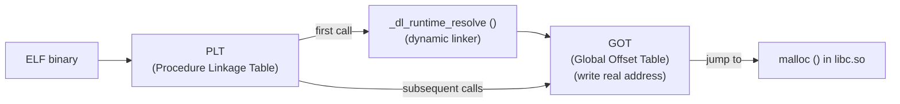

## Question

Explain dynamic linking in Linux: how the dynamic linker resolves symbol addresses at runtime, the PLT/GOT lazy binding mechanism, and how `LD_PRELOAD` intercepts function calls.

## Answer

**Static vs dynamic linking:**
- **Static:** All library code copied into the binary. Large binary; no shared memory benefit.
- **Dynamic:** Binary references shared libraries (`.so`). Library loaded into memory once, shared across all processes using it.

**ELF binary structure for dynamic calls:**



**Lazy binding (default):** On the first call to `malloc()`:
1. Code calls `PLT[malloc]` stub.
2. PLT stub jumps to GOT entry — initially points to PLT resolver.
3. Resolver calls the dynamic linker `_dl_runtime_resolve()`.
4. Linker finds `malloc` in `libc.so`, writes its real address into the GOT.
5. Next call: PLT stub → GOT → real `malloc` directly. No resolver.

**`LD_PRELOAD` — function interception:**
```bash
LD_PRELOAD=/path/to/mymalloc.so ./program
```
The dynamic linker loads your `.so` first. When `malloc` is searched, your version is found first in the symbol table and placed in the GOT. You can call the original with `dlsym(RTLD_NEXT, "malloc")`.

**Use cases:**
- Debugging: log all `malloc`/`free` calls.
- Profiling: jemalloc, tcmalloc replace system allocator via `LD_PRELOAD`.
- Testing: mock `time()` to return fixed values.
- Security tools: intercept network calls.

**`ldd` and `ldconfig`:**
```bash
ldd /usr/bin/ls           # show all shared library dependencies
ldconfig -p               # show shared library cache
readelf -d ./binary | grep NEEDED  # required libraries
```

**Security — RELRO + now:**
```bash
gcc -Wl,-z,relro,-z,now   # resolve all symbols at startup; make GOT read-only
```
Prevents GOT overwrite attacks (a class of memory corruption exploitation).

## Follow-ups

- What is `RUNPATH` vs `RPATH` and how do they affect library search order?
- How does `dlopen()`/`dlsym()` work for runtime plugin loading?
- What is the "symbol visibility" problem when building shared libraries?
