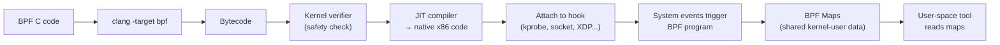

## Question

Explain eBPF: what it is, how the verifier ensures safety, the key program types (tracing, networking, security), and the major tools built on it (bcc, bpftrace, Cilium, Falco).

## Answer

**What eBPF is:** Extended Berkeley Packet Filter — a sandboxed virtual machine in the Linux kernel. Programs written in restricted C, compiled to eBPF bytecode, loaded into the kernel, verified for safety, then JIT-compiled to native code. Run at specific kernel hook points.

**Safety guarantees (verifier):**
- No unbounded loops.
- No invalid memory access (bounds checked).
- All paths must terminate.
- No calling arbitrary kernel functions (only approved BPF helpers).
- Programs run in kernel context but cannot crash the kernel.



**Key program types:**

| Type | Hook | Use case |
|---|---|---|
| `kprobe/kretprobe` | Any kernel function | Trace kernel internals |
| `uprobe/uretprobe` | User-space function | Trace application code without recompilation |
| `tracepoint` | Stable kernel trace events | Performance tracing |
| `XDP` (eXpress Data Path) | NIC driver level | Ultra-fast packet filtering before kernel networking stack |
| `TC` (Traffic Control) | Network queue | Bandwidth shaping, NAT |
| `socket filter` | Socket receive path | Classic BPF packet filtering (tcpdump) |
| `LSM` | Security hooks | Kernel security policy enforcement |

**BPF Maps:** Shared key-value stores between BPF programs and user space. Used to aggregate data (histograms, counters) and pass configuration.

**Major tools:**

- **bcc (BPF Compiler Collection):** Python/Lua scripts for tracing. `opensnoop`, `execsnoop`, `tcplife`, `fileslower`.
- **bpftrace:** High-level awk-like language for BPF tracing. `bpftrace -e 'kprobe:do_sys_open { printf("%s\n", str(arg1)); }'`.
- **Cilium:** eBPF-based Kubernetes networking + security. Replaces iptables entirely.
- **Falco:** eBPF-based runtime security — detects suspicious syscall patterns.
- **Pixie:** Auto-instrumented observability without code changes.

**Example — count syscalls:**
```bash
bpftrace -e 'tracepoint:raw_syscalls:sys_enter { @[comm] = count(); }'
```

## Follow-ups

- What is XDP (eXpress Data Path) and how does it achieve line-rate packet processing?
- How does Cilium replace kube-proxy and iptables with eBPF?
- What is BTF (BPF Type Format) and how does CO-RE (Compile Once, Run Everywhere) work?
