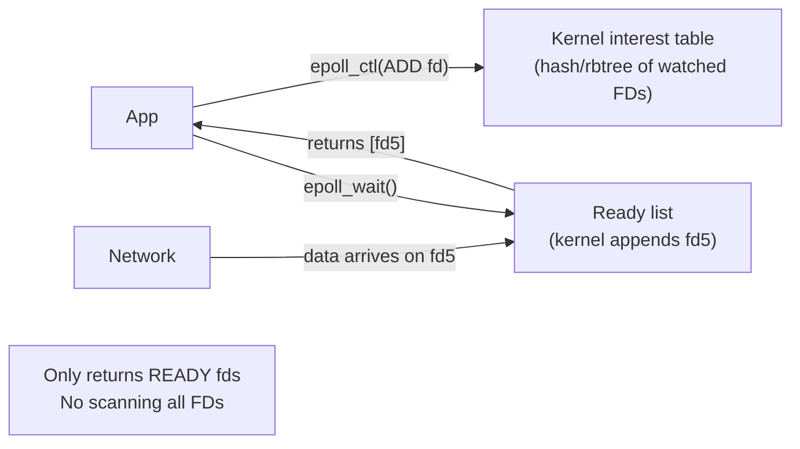

## Question

Compare `select`, `poll`, and `epoll`: the algorithmic complexity difference, how `epoll` avoids the O(n) scan, edge-triggered vs level-triggered modes, and what the C10k problem is.

## Answer

**C10k problem:** How to handle 10,000 concurrent network connections on one server? With one thread per connection → 10,000 threads = memory and scheduling overhead. Solution: I/O multiplexing with a single thread.

**`select` limitations:**
- Takes an `fd_set` bitmask up to `FD_SETSIZE` (1024 on many systems).
- On each call: copies the bitmask to kernel, kernel scans all FDs, copies back.
- O(n) per call — n = max FD watched. At 10k FDs: 10k operations per loop iteration.
- **Modified in place:** Must re-add FDs every iteration.

**`poll` improvements:** No FD_SETSIZE limit (uses array), but still O(n) per call.

**`epoll` design (O(1) per event):**

`epoll_ctl(EPOLL_CTL_ADD)` — registers an fd once. Kernel maintains an internal list of watched FDs.
`epoll_wait()` — blocks until at least one fd is ready. Returns ONLY the ready FDs. O(1) relative to total watched FDs; O(k) where k = number of events.

**Kernel mechanism:** File descriptors register a "wait queue" callback with the socket/pipe. When data arrives, the network stack calls the callback, which appends the fd to epoll's ready list. `epoll_wait` just drains this list.

**Edge-triggered (EPOLLET) vs level-triggered:**
- **Level-triggered (default):** `epoll_wait` returns whenever fd is still readable. If you only read 100 bytes of 1000 available, next `epoll_wait` returns again.
- **Edge-triggered:** Returns only on transitions (fd becomes readable). Must read ALL data until EAGAIN. Fewer `epoll_wait` returns; requires non-blocking I/O + read loop.
- Nginx uses edge-triggered for performance.

**`EPOLLONESHOT`:** After one notification, fd is automatically deactivated. Re-arm with `EPOLL_CTL_MOD`. Useful in multi-threaded servers to prevent multiple threads handling the same fd simultaneously.

## Follow-ups

- Why does `epoll` have an internal rbtree for the interest set and a linked list for the ready list?
- How does `EPOLLERR` and `EPOLLHUP` fire — do they require explicit registration?
- How does `io_uring`'s poll mode relate to `epoll`?
