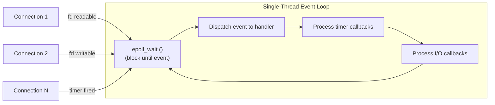

## Question

Explain the event loop concurrency model: how a single thread handles thousands of concurrent connections, what types of work block the loop, and how systems like Node.js, Redis, and Nginx achieve high concurrency with this model.

## Answer

**Core idea:** Instead of one thread per connection (blocking), use one thread + I/O multiplexing to handle all connections. The thread never blocks — it processes I/O events as they arrive.

**What the event loop does:**
1. Call `epoll_wait` — block until at least one I/O event is ready.
2. For each ready event, call the registered handler (callback).
3. Handler runs to completion (non-blocking), registering new I/O operations.
4. Loop repeats.

**What blocks the event loop:**
- CPU-bound computation (JSON parsing of large payload, crypto, image processing).
- Synchronous file I/O (most OS file operations are blocking).
- Synchronous DNS resolution.
- Long-running JavaScript callbacks.

**Why it works:** Most web server time is waiting for I/O (network, disk, DB). With `epoll`, the single thread services hundreds of thousands of concurrent connections — none block; they all wait in the OS-level event queue.

**Implementations:**

| System | Event loop | Concurrency model |
|---|---|---|
| Node.js | libuv (epoll/kqueue) | Single JS thread + thread pool for file I/O |
| Nginx | epoll | 1 worker per CPU, event-driven |
| Redis | ae (simple event loop) | Single-threaded commands, fast in-memory ops |
| Netty | NIO Selector | N boss threads + M worker threads |

**Redis is single-threaded for commands:** Since all operations are in-memory (microsecond latency), a single event loop thread achieves ~1M ops/sec. Network I/O is the bottleneck, not the CPU. Redis 6+ added multi-threaded I/O for network handling while keeping command processing single-threaded.

**Node.js offloads blocking work:**
- `libuv` thread pool (default 4) handles file system, crypto, DNS.
- CPU-bound work → `worker_threads`.

## Follow-ups

- What is the difference between "concurrency" and "parallelism" in the context of the event loop?
- Nginx uses multiple worker processes, not threads — why, and how does `SO_REUSEPORT` help?
- How does the Redis command pipeline interact with the event loop?
