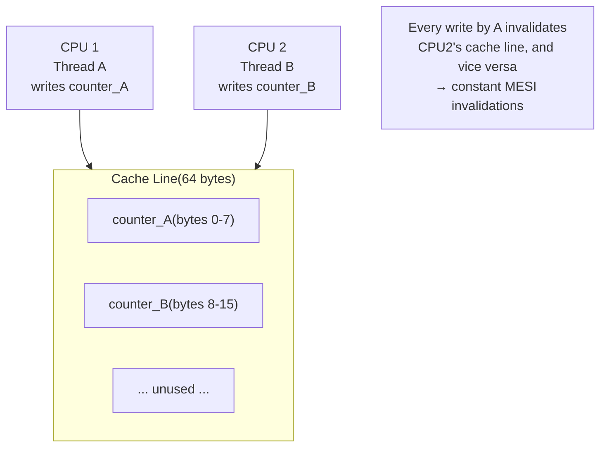

## Question

Explain false sharing: what it is, why it causes severe performance degradation on multi-core systems, and how padding or alignment fixes it. Give a concrete before/after benchmark scenario.

## Answer

**CPU Cache Architecture:** Modern CPUs cache memory in **cache lines** — typically 64 bytes. When a CPU writes to a memory location, it invalidates that cache line in all other CPU caches (MESI protocol).

**False sharing:** Two threads on different CPUs write to **different variables that happen to live on the same cache line**. The writes force constant cache line bouncing between CPUs even though threads are accessing logically unrelated data.



**Performance impact:** Can slow a parallel loop by 10-100x, making it slower than single-threaded code. The bottleneck is the memory bus and cache coherence protocol, not the actual computation.

**Example — before (false sharing):**
```java
long[] counters = new long[2];
// Thread 0 increments counters[0]
// Thread 1 increments counters[1]
// Both are 8 bytes → same cache line → false sharing!
```

**Fix 1 — Padding:**
```java
// Pad each counter to fill a full cache line (64 bytes)
class PaddedCounter {
    long value;
    long p1, p2, p3, p4, p5, p6, p7;  // 7 × 8 = 56 bytes padding
}
```

**Fix 2 — `@Contended` annotation (Java 8+):**
```java
@sun.misc.Contended
class Counter { volatile long value; }
// JVM adds 128-byte padding automatically
```
Run with `-XX:-RestrictContended`.

**Fix 3 — Thread-local accumulation:**
Each thread keeps a local counter; merge at the end. No sharing at all during computation.

**Detection:** Linux `perf stat -e cache-misses,cache-references ./program` shows elevated cache misses. JMH benchmarks reveal surprising performance degradation.

## Follow-ups

- Explain the MESI cache coherency protocol (Modified, Exclusive, Shared, Invalid).
- How does the JVM layout object fields — can it reorder them to reduce false sharing?
- How does false sharing manifest in a Java `long[]` vs a `long[][]`?
