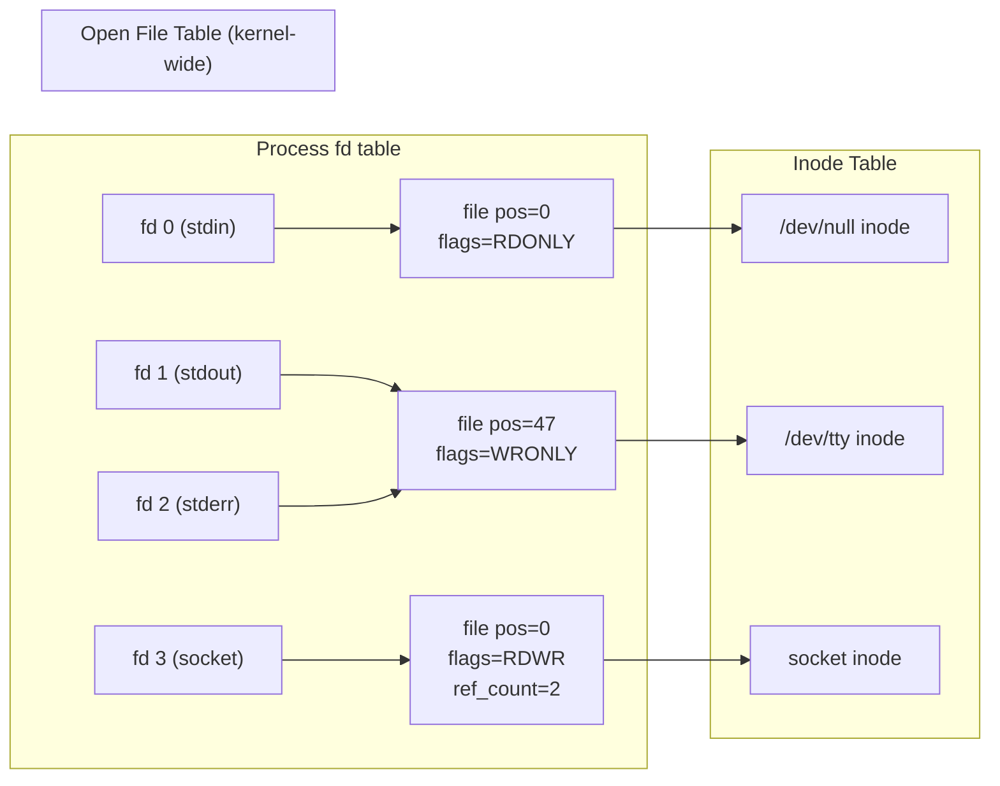

## Question

Explain the file descriptor abstraction: the three-level table (fd table → open file table → inode table), what `dup`/`dup2` does, the close-on-exec flag, and how fd limits cause production issues.

## Answer

**Three-level structure:**



**Key rules:**
- FD is a per-process integer index into its fd table.
- Open File Table entry contains: current file position, access flags, ref count.
- Multiple FDs (in same or different processes) can point to the same OFT entry (via `dup`, `fork`).
- Multiple OFT entries can point to the same inode (same file opened multiple times independently — each has its own position).

**`dup`/`dup2`:**
```c
int dup(int oldfd);          // returns new fd pointing to same OFT entry
int dup2(int oldfd, int newfd);  // redirects newfd to same OFT entry as oldfd
// Classic: redirect stdout to a file
int fd = open("output.log", O_WRONLY|O_CREAT, 0644);
dup2(fd, STDOUT_FILENO);  // fd 1 now points to output.log
close(fd);
```

**`O_CLOEXEC` / `close-on-exec`:**
By default, FDs are inherited across `exec()`. Set `FD_CLOEXEC` flag (or use `open(..., O_CLOEXEC)`) so the FD is automatically closed when the process calls `exec()`. **Always use `O_CLOEXEC`** for security — prevents leaking FDs to child processes.

**FD limits:**
```bash
ulimit -n           # per-process soft limit (default 1024)
ulimit -n 65536     # raise for current session
cat /proc/sys/fs/file-max  # system-wide limit
# Production services should set in /etc/security/limits.conf or systemd:
# LimitNOFILE=65536
```

Hitting FD limits: `open()` returns `EMFILE` ("Too many open files"). Check with `lsof -p <pid> | wc -l`.

**Stdin (0), stdout (1), stderr (2):** Convention, not kernel requirement. Processes rely on these being pre-opened by their parent/shell.

## Follow-ups

- What happens to a file's data if you delete (unlink) it while a process has it open?
- What is `sendfile()` and why does it avoid copying FD data through userspace?
- How do `pipe()` and `socketpair()` create connected FD pairs?
