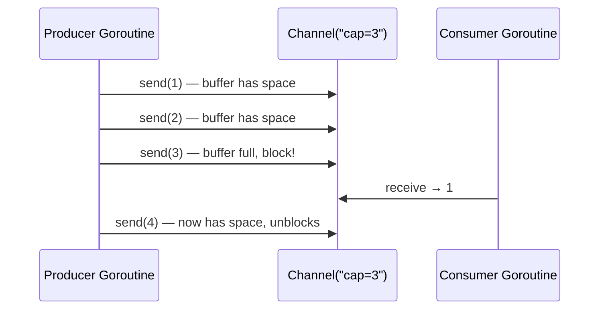

## Question

Explain Go channel semantics (buffered vs unbuffered), how they relate to CSP, and the decision rule for choosing channels vs mutexes (share memory by communicating vs communicate by sharing memory).

## Answer

**Channel fundamentals:**

A channel is a typed, goroutine-safe communication pipe. Sending and receiving can be synchronizing points.

**Unbuffered channel (sync):** `ch := make(chan T)`
- Send blocks until a receiver is ready.
- Receive blocks until a sender is ready.
- Guarantees a rendezvous — like a baton handoff.

**Buffered channel:** `ch := make(chan T, N)`
- Send only blocks when buffer is full.
- Receive only blocks when buffer is empty.
- Decouples sender and receiver timing.



**Select statement:** Wait on multiple channels:
```go
select {
case msg := <-ch1:
    handle(msg)
case msg := <-ch2:
    handle(msg)
case <-time.After(timeout):
    // timed out
}
```

**CSP (Communicating Sequential Processes):** Go's channel model is based on Hoare's CSP — concurrency through communication, not shared memory. The mantra: *"Do not communicate by sharing memory; share memory by communicating."*

**When to use channels:**
- Passing ownership of data between goroutines (producer/consumer).
- Signaling events (done signals, cancellation via `context`).
- Distributing work to a pool of goroutines.
- Coordinating pipeline stages.

**When to use mutexes:**
- Protecting a shared cache or map with many readers and infrequent writes (`sync.RWMutex`).
- Simple state that multiple goroutines need to read/modify in place.
- Performance-critical paths where channel overhead matters.

**Closing channels:** Only the sender should close. Receiving from a closed channel returns the zero value + false. Use `for v := range ch` to consume until close.

**Common pitfalls:**
- Sending to a closed channel: panics.
- Deadlock: all goroutines blocked on channels with no progress.
- Goroutine leaks: goroutine blocked forever on a channel nobody reads.

## Follow-ups

- How does Go's `context` package implement cancellation via channels?
- What is the fan-out / fan-in pattern in Go?
- How would you implement a rate limiter using a channel as a token bucket?
