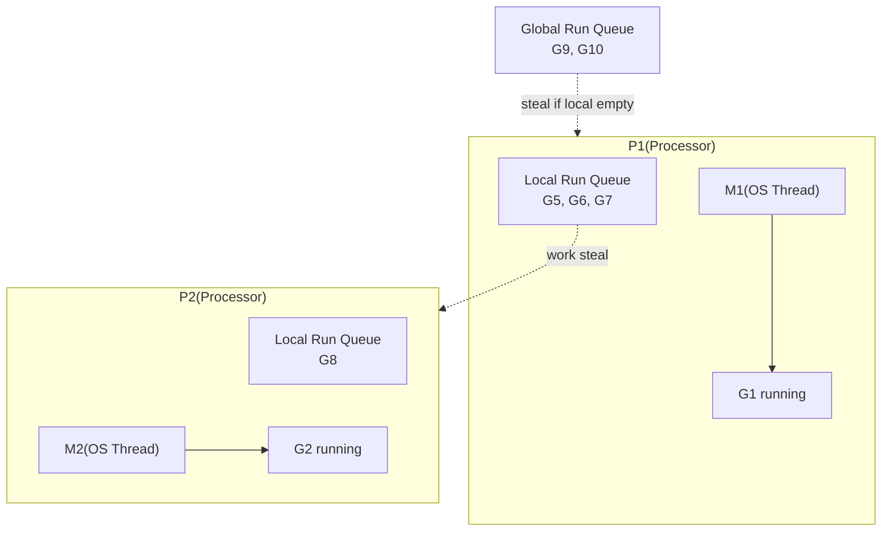

## Question

Explain Go's GMP concurrency model: what G, M, and P represent, how goroutines are scheduled onto OS threads, how work stealing works, and why goroutines are cheap enough to create in the millions.

## Answer

**GMP Components:**

- **G (Goroutine):** A lightweight concurrent unit. Initial stack ~2 KB (grows dynamically up to 1 GB). Holds the goroutine's stack, instruction pointer, and scheduling state.
- **M (Machine):** An OS thread. Runs goroutines. There are typically GOMAXPROCS OS threads running at a time.
- **P (Processor):** A logical processor — a scheduling context. There are exactly `GOMAXPROCS` P's (default = num CPU cores). A P holds a local run queue of goroutines and connects M to G.

**Scheduling flow:**
1. `go func()` creates a G, added to local run queue.
2. If local queue is full, move half to global queue.
3. M looks in its P's local queue → global queue → steal from other P's.

**Work stealing:** When a P's local queue is empty, it steals goroutines from another P's local queue (takes half). This keeps all CPUs busy without a central bottleneck.

**Preemption:** Go 1.14+ supports asynchronous preemption via signals — goroutines can be preempted at any safe point, not just function calls. Prevents one CPU-bound goroutine from starving others.

**Syscalls:** When a goroutine makes a blocking syscall, the M is released from P. Another M picks up that P and continues running goroutines. When the syscall returns, the goroutine tries to get a P; if none available, it goes to global queue.

**Why goroutines are cheap:**
- 2 KB stack (vs 1-8 MB for OS threads).
- No kernel involvement for creation.
- Context switch is user-space only (~hundreds of nanoseconds vs ~µs for OS context switch).
- You can run millions of goroutines on a laptop.

## Follow-ups

- What is `GOMAXPROCS` and when would you increase or decrease it?
- How does Go handle goroutine stack growth? (Segmented vs. contiguous stacks — Go uses contiguous with copying.)
- What is the difference between a goroutine blocking on a channel vs blocking on a syscall?
