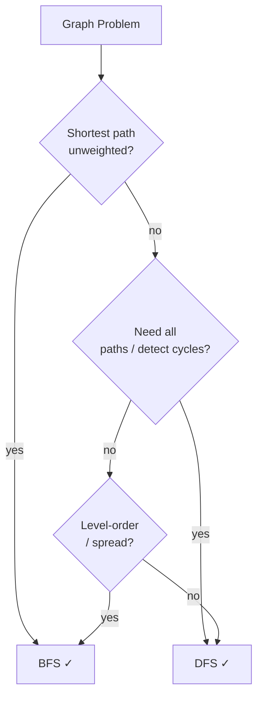

## Question

You have a graph problem. Walk through the decision of using BFS vs DFS: what guarantees does each give, what are the space tradeoffs, and give real examples where each is the right choice?

## Answer

**BFS (Breadth-First Search):**
- Uses a **queue**. Explores all neighbors at distance k before k+1.
- Guarantees **shortest path** in an **unweighted** graph.
- Space: O(width) — can be O(n) for wide, shallow graphs (e.g., trees with many leaves).
- Good for: shortest path, level-order traversal, 0-1 BFS, multi-source BFS.

**DFS (Depth-First Search):**
- Uses a **stack** (implicit via recursion or explicit).
- Space: O(depth) — O(log n) for balanced trees, O(n) worst case.
- Finds **a** path, not necessarily shortest.
- Good for: cycle detection, topological sort, connected components, all paths, backtracking, SCC (Kosaraju/Tarjan).

**Space comparison:**
- BFS on a complete binary tree at depth d stores 2^d nodes in the queue.
- DFS only stores d nodes on the stack.
- For deep, narrow graphs: BFS wins. For wide, shallow: DFS wins on space.

**Concrete use cases:**

| Scenario | Algorithm |
|---|---|
| Shortest route in a maze | BFS |
| Detect cycle in directed graph | DFS |
| Topological sort of tasks | DFS |
| Web crawler (spread by level) | BFS |
| Find all valid orderings | DFS + backtracking |
| Friend-of-friend at distance ≤ 2 | BFS |

## Follow-ups

- How does Dijkstra's extend BFS for weighted graphs?
- How would you do a bidirectional BFS and when does it help?
- Explain how DFS produces a spanning tree and what tree/back/forward/cross edges mean.
