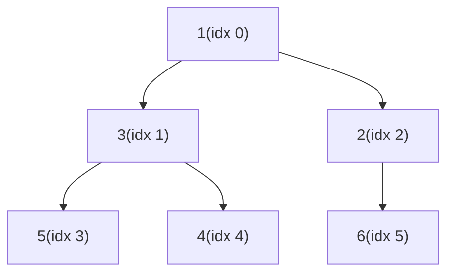

## Question

Explain the binary heap data structure: its invariant, how insertion and extraction work, and the O(n) `heapify` trick. Then explain when you'd prefer a heap over a BST.

## Answer

**Heap invariant:** In a min-heap, every parent ≤ its children. This means the minimum is always at the root. Max-heap is the reverse.

**Array representation:** For node at index `i`:
- Left child: `2i + 1`
- Right child: `2i + 2`
- Parent: `(i - 1) / 2`

No pointers needed — cache-friendly.

**Operations:**
- **Insert** (`sift up`): place at end, swap with parent while parent > new node. O(log n).
- **Extract-min** (`sift down`): swap root with last, remove last, sift root down swapping with the smaller child. O(log n).
- **Peek:** O(1) — root is always min.

**Build heap in O(n):** Start from the last non-leaf (`n/2 - 1`) and sift down each node. Each level does less work; the sum converges to O(n). Naively inserting one by one is O(n log n).

**Heap vs BST:**

| Need | Choose |
|---|---|
| Just min/max fast | Heap |
| Find arbitrary key | BST |
| Sorted traversal | BST |
| Top-K elements | Heap |
| Range queries | BST |
| Simpler, cache-friendly | Heap |

Heaps are arrays — better cache locality. BSTs require pointer traversal. For a priority queue, heaps win. For ordered iteration or range queries, BSTs win.

## Follow-ups

- How does Dijkstra's algorithm use a min-heap, and what is the resulting time complexity?
- What is a Fibonacci heap and why is it used in Prim's/Dijkstra's theoretical analysis?
- How do you find the median of a stream using two heaps?
