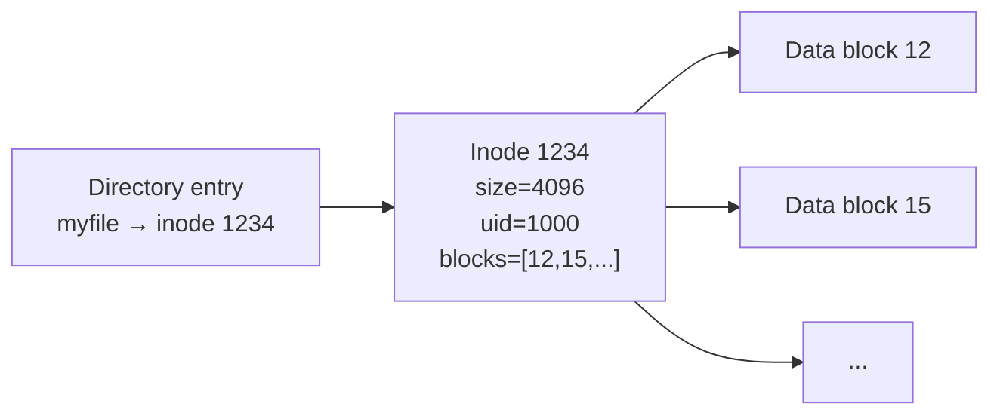

## Question

Explain inodes: what metadata they store, the difference between hard links and symlinks, and what happens when you delete a file that a process has open. Why can disks fill up on inodes before disk space?

## Answer

**Inode:** A data structure on disk that stores metadata about a file (everything except the filename).

**Inode contents:**
- File type (regular, directory, symlink, device, socket, pipe)
- Permissions (owner, group, mode bits)
- Owner UID/GID
- File size
- Timestamps: atime (access), mtime (modify), ctime (change)
- Link count (number of hard links)
- Pointers to data blocks (direct, indirect, double-indirect)
- **NOT the filename** — that lives in the directory entry



**Hard links:** Multiple directory entries pointing to the same inode. `ln file1 file2` — both `file1` and `file2` share inode 1234. Link count increases. File is deleted only when link count reaches 0 AND no process has it open.

**Symlinks:** A separate inode whose data is a path string. `ln -s file1 link1` — `link1` is an inode whose content is "file1". If `file1` is deleted, `link1` is a dangling symlink.

**Deleting an open file:**
```bash
rm myfile          # removes directory entry, decrements link count
# If a process has myfile open, link count = 0 but inode not freed
# The file's data is accessible via /proc/<pid>/fd/<fd>
# Inode freed when last FD is closed
```
This is why `rm`-ing a log file doesn't free disk space if a process still has it open. Use `truncate` or `> logfile` instead, or `lsof | grep deleted` to find them.

**Inode exhaustion:**
```bash
df -i    # shows inode usage per filesystem
# Filesystem  Inodes   IUsed   IFree  IUse%
# /dev/sda1   1048576  1048573     3   100%
```
Many small files (tmp files, inode-heavy workloads like Git objects) can exhaust inodes even with disk space remaining. Fix at format time with `mkfs.ext4 -N <inode_count>`.

**`stat` command:**
```bash
stat myfile
# Inode: 1234, Links: 2, Size: 4096, ...
```

## Follow-ups

- What is a "journal" in journaling filesystems (ext4, XFS) and what does it protect?
- How does `unlink()` differ from `remove()` in C?
- Why can't you hard link across filesystems? (Inodes are filesystem-local.)
