## Question

Given a list of intervals `[start, end]`, merge all overlapping intervals and return the result. Then explain three follow-up variants: insert an interval, find the minimum number of meeting rooms, and find the employee free time.

## Answer

**Merge overlapping intervals:**

1. Sort by start time — O(n log n).
2. Walk through: if current interval overlaps previous, extend the previous; otherwise push new interval.

```python
def merge(intervals):
    intervals.sort(key=lambda x: x[0])
    merged = [intervals[0]]
    for start, end in intervals[1:]:
        if start <= merged[-1][1]:
            merged[-1][1] = max(merged[-1][1], end)
        else:
            merged.append([start, end])
    return merged
```

**Two intervals overlap iff** `a.start ≤ b.end AND b.start ≤ a.end`. After sorting, you only need to check `curr.start ≤ prev.end`.

```mermaid
gantt
    title Interval Merging Example
    dateFormat X
    axisFormat %s
    section Input
    [1,3]  : 1, 3
    [2,6]  : 2, 6
    [8,10] : 8, 10
    [9,12] : 9, 12
    section Output
    [1,6]  : 1, 6
    [8,12] : 8, 12
```



**Insert interval:** Binary search for insertion point, then merge O(n). Or linear scan O(n).

**Minimum meeting rooms (interval scheduling):** Use a min-heap of end times. For each new meeting sorted by start: if heap.top() ≤ start, recycle the room (pop, push new end). Else add a room. Answer = heap.size(). O(n log n).

**Employee free time:** Collect all intervals, sort, merge. Gaps between merged intervals = free time. O(n log n).

**Sweep line variant:** Push all start/end events. Sort. Walk: `+1` on start, `-1` on end. Count tracks overlap depth → find when depth = 0.

## Follow-ups

- What's the maximum number of overlapping intervals at any point? (Sweep line, track peak depth.)
- How do you find the intersection of two sorted interval lists? (Two-pointer, O(n+m).)
- Non-overlapping intervals: what is the minimum number to remove to make all non-overlapping? (Greedy: keep the one ending earliest.)
