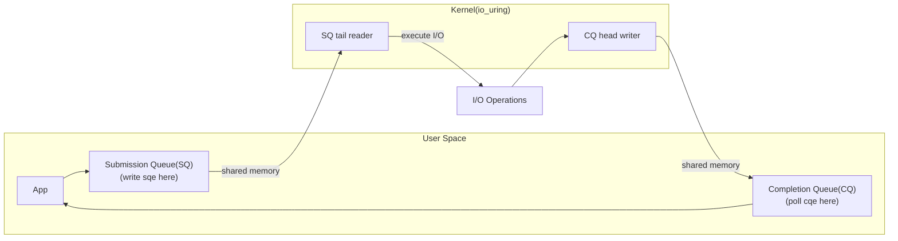

## Question

Explain `io_uring` (Linux 5.1+): the problem it solves with traditional async I/O, the submission/completion ring design, and why it dramatically reduces syscall overhead for high-throughput I/O.

## Answer

**Problems with traditional async I/O:**

- **`read()`/`write()`:** Blocking — thread waits.
- **`aio_read()`:** POSIX AIO — inconsistent, doesn't work for all file types, complex.
- **`epoll` + non-blocking:** Works great for network, but file I/O still blocks (no true async for most FS).
- **Every I/O operation = 1 syscall** — at 10M IOPS, syscall overhead dominates.

**`io_uring` design:**

Two shared ring buffers between user space and kernel — no per-operation syscalls:



**Submission:** User writes a Submission Queue Entry (SQE) into the ring buffer. One `io_uring_enter()` syscall can submit thousands of operations. Or use `IORING_SETUP_SQPOLL` — a kernel thread polls the SQ, eliminating the syscall entirely for the hot path.

**Completion:** Kernel writes Completion Queue Entries (CQEs) as operations complete. User polls CQ without any syscall.

**Supported operations:** `read`, `write`, `recv`, `send`, `accept`, `connect`, `fsync`, `openat`, `close`, `splice`, `statx`, `timeout`, and more.

**Performance:**
- Traditional: 1 syscall per I/O operation.
- `io_uring` with `SQPOLL`: **0 syscalls** per I/O on the hot path — pure memory operations.
- Benchmarks show 2-4x improvement over `epoll` for high-IOPS workloads.
- Used by: RocksDB, QEMU, Nginx (experimental), liburing library.

**Fixed buffers (`IORING_OP_READ_FIXED`):** Register buffers with the kernel once — avoids per-operation memory pinning/unpinning. Further reduces overhead.

**Example with liburing:**
```c
struct io_uring ring;
io_uring_queue_init(256, &ring, 0);

struct io_uring_sqe *sqe = io_uring_get_sqe(&ring);
io_uring_prep_read(sqe, fd, buf, len, 0);
io_uring_submit(&ring);   // one syscall for all pending ops

struct io_uring_cqe *cqe;
io_uring_wait_cqe(&ring, &cqe);  // wait for completion
```

## Follow-ups

- How does `io_uring`'s `IORING_SETUP_SQPOLL` work and why does it require elevated privileges?
- Compare `io_uring` to Windows IOCP (completion ports) — what are the similarities?
- What are the security implications of `io_uring` and why was it restricted in some container environments?
