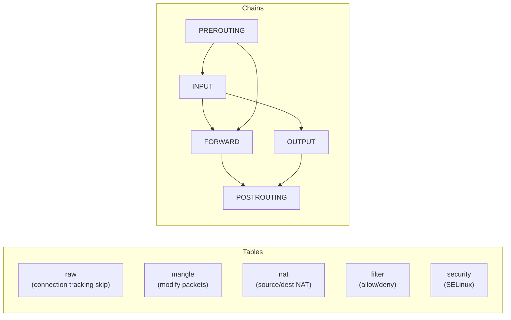

## Question

Explain `iptables`/`nftables` architecture: tables, chains, targets. How do you write rules for common scenarios (allow port, NAT, rate limiting), and why Kubernetes uses iptables for service IP routing.

## Answer

**`iptables` architecture:**



**Reading existing rules:**
```bash
iptables -L -n -v               # filter table, all chains, numeric, verbose
iptables -t nat -L -n -v        # NAT table
iptables-save                   # dump all rules
```

**Common operations:**
```bash
# Allow inbound port 443
iptables -A INPUT -p tcp --dport 443 -j ACCEPT

# Block source IP
iptables -A INPUT -s 192.168.1.100 -j DROP

# SNAT (masquerade outbound from container)
iptables -t nat -A POSTROUTING -s 172.16.0.0/24 -o eth0 -j MASQUERADE

# DNAT (port forward: incoming :8080 → internal :80)
iptables -t nat -A PREROUTING -p tcp --dport 8080 -j DNAT --to-destination 10.0.0.5:80

# Rate limiting (anti-DoS)
iptables -A INPUT -p tcp --dport 22 -m limit --limit 5/min -j ACCEPT

# Connection tracking (allow established)
iptables -A INPUT -m conntrack --ctstate ESTABLISHED,RELATED -j ACCEPT
```

**Kubernetes kube-proxy uses iptables (or ipvs):**
Every Service IP gets iptables rules with `DNAT` and probabilistic load balancing:
```bash
# Service ClusterIP:80 → pods with probability:
-A KUBE-SVC-... -m statistic --mode random --probability 0.33 -j KUBE-SEP-POD1
-A KUBE-SVC-... -m statistic --mode random --probability 0.5  -j KUBE-SEP-POD2
-A KUBE-SVC-... -j KUBE-SEP-POD3
```
At scale (>10k services), iptables rule updates become O(n²) — reason Cilium replaces with eBPF.

**`nftables` (modern replacement):**
```bash
nft list ruleset
nft add rule ip filter input tcp dport 443 accept
# Advantages: single framework (no iptables/ip6tables/arptables split),
# atomic rule updates, better performance, set-based rules
```

## Follow-ups

- What is `ipset` and why is it faster than individual IP match rules?
- How does `IPVS` (IP Virtual Server) differ from iptables for Kubernetes service load balancing?
- What is `conntrack` (connection tracking) and what happens when the conntrack table fills up?
