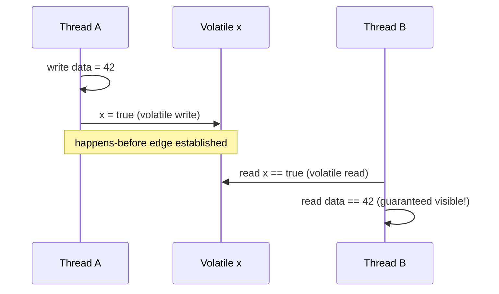

## Question

Explain the Java Memory Model (JMM): why it exists, what "happens-before" means formally, and the specific operations that establish a happens-before edge. What does the JMM permit compilers and CPUs to do?

## Answer

**Why the JMM exists:**

Modern hardware and compilers reorder instructions for performance — CPU out-of-order execution, compiler optimizations, store buffers. Without rules, two threads reading/writing shared memory would see arbitrary, non-intuitive orderings. The JMM specifies what values a read is *allowed* to see, giving programmers a contract.

**Happens-before (HB) relation:**

If action A happens-before action B, then A's effects (writes) are visible to B. HB is transitive: if A HB B and B HB C, then A HB C.

**Operations that create happens-before edges:**

1. **Program order:** Each action in a thread HB every subsequent action in that thread.
2. **Monitor lock:** Unlock of a `synchronized` block HB any subsequent lock of the same monitor.
3. **Volatile write:** A write to a `volatile` variable HB any subsequent read of that variable.
4. **Thread start:** `Thread.start()` HB every action in the started thread.
5. **Thread join:** Every action in thread T HB `T.join()` returning.
6. **Default initialization:** All default field initialization (0, null, false) HB any action.

**What the JMM permits:** Without HB relationships, the JMM allows reads to see any write — including prior writes by any thread. Compilers can reorder instructions. CPUs can buffer stores. Two threads communicating without synchronization may see completely inconsistent views of memory.

**Practical rules:**
- All shared mutable data must be accessed under synchronization or via `volatile`/`Atomic*`.
- A correctly synchronized program behaves as if executed sequentially.
- Data races (no HB between conflicting accesses) result in undefined behavior (any value may be seen).

## Follow-ups

- Why can a correctly synchronized Java program still have bugs? (Logic bugs — JMM only guarantees visibility, not correctness.)
- How does the JMM handle the `final` keyword? (Final fields are safely published once the constructor completes.)
- Compare the JMM to the C++ memory model's `memory_order` enum.
