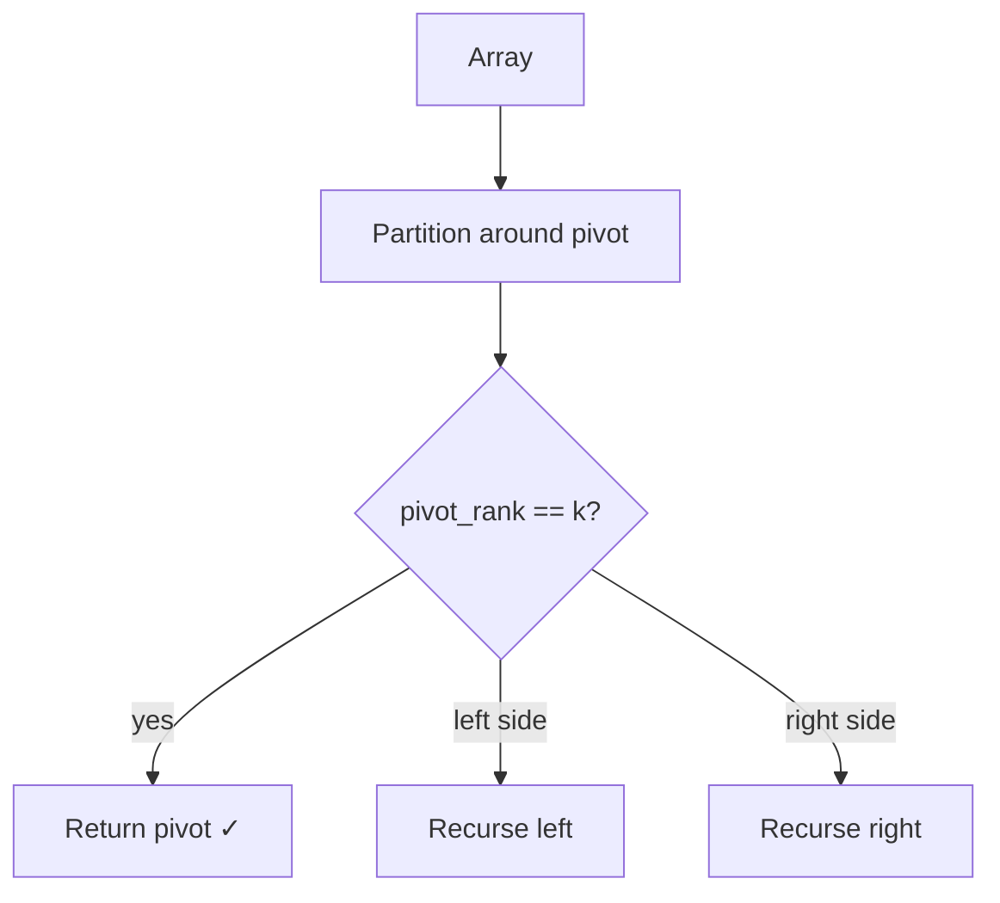

## Question

Find the Kth largest element in an unsorted array. Compare sorting, the min-heap approach, and quickselect in terms of time complexity, space, and when each is preferable.

## Answer

**Approach 1 — Sort:** Sort descending, return index k-1. O(n log n) time, O(1) extra space (in-place sort). Simple but wasteful — we compute a total order when we only need the Kth element.

**Approach 2 — Min-heap of size K:**
Maintain a min-heap of the K largest seen so far. The heap top is the Kth largest.
```python
import heapq
def kth_largest(nums, k):
    heap = nums[:k]
    heapq.heapify(heap)         # O(k)
    for n in nums[k:]:
        if n > heap[0]:
            heapq.heapreplace(heap, n)   # O(log k)
    return heap[0]
```
Time: O(n log k). Space: O(k). **Best for streaming** (can't hold all data) or when k << n and you want to minimize memory.

**Approach 3 — Quickselect:**
Partition the array around a pivot (like quicksort's partition). After partition, the pivot is at its sorted position. Recurse only into the side that contains rank k.
```python
def quickselect(nums, lo, hi, k):
    pivot_idx = partition(nums, lo, hi)
    if pivot_idx == k: return nums[k]
    elif pivot_idx < k: return quickselect(nums, pivot_idx+1, hi, k)
    else: return quickselect(nums, lo, pivot_idx-1, k)
```
- Average: **O(n)** — each recursive call roughly halves the problem.
- Worst case: O(n²) with bad pivots (sorted input). Randomize pivot to make this astronomically unlikely.
- Space: O(1) extra (in-place partition, O(log n) stack average).



**When to use each:**
- Quickselect: large array in memory, best average performance needed.
- Min-heap: streaming data or k very small.
- Sort: code simplicity matters and n is small.

**Median of medians** guarantees O(n) worst case for quickselect but with a large constant — rarely used in practice.

## Follow-ups

- How does `nth_element` in C++ STL work? (Introselect: quickselect + median-of-medians fallback.)
- Find the K closest points to the origin — what data structure?
- Top-K frequent elements — how do you do better than O(n log n) sort? (Bucket sort on frequency, O(n).)
