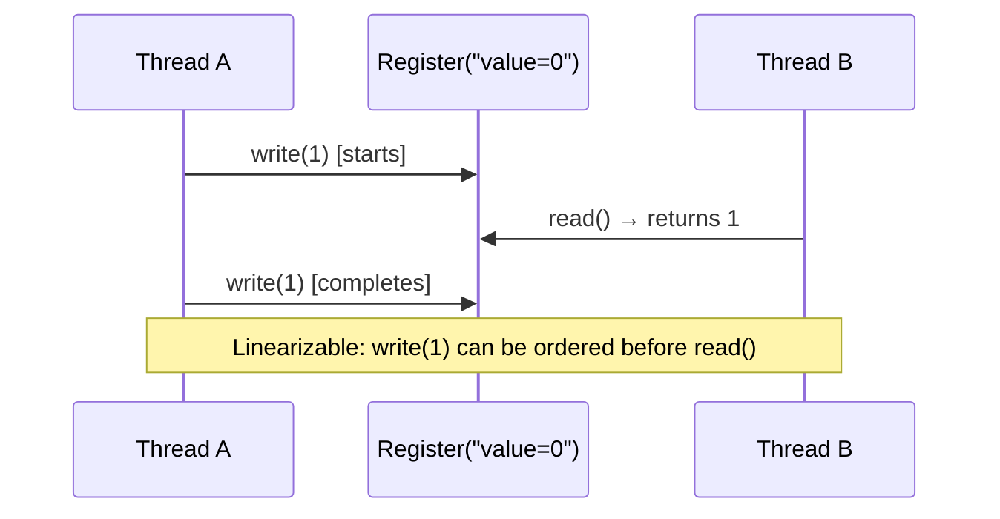

## Question

Define linearizability as a correctness condition for concurrent objects. How does it differ from sequential consistency and serializability? Give an example showing when a concurrent operation is or isn't linearizable.

## Answer

**Linearizability:** A concurrent execution of operations on a shared object is linearizable if there exists a sequential ordering of operations such that:
1. The sequential ordering is consistent with the object's sequential specification (correct behavior).
2. The sequential ordering respects the real-time order of non-overlapping operations.

In other words: every operation appears to take effect atomically at some point between its invocation and response.



**Non-linearizable example:**
```
Thread A: write(1) [t=0..2]
Thread B: write(2) [t=1..3]
Thread C: read() → 0  [t=4]  ← impossible in any sequential order after both writes
```

Returning 0 after both writes completed is not linearizable — the read must see one of the writes.

**Comparison:**

| Property | Description | Requires real-time order? |
|---|---|---|
| **Linearizability** | Each op appears atomic at some point in its interval | ✓ Yes |
| **Sequential consistency** | All threads see same total order; program order preserved | ✗ No (can reorder) |
| **Serializability** | (Databases) Transactions appear to run serially | ✗ No (just some serial order) |
| **Strict serializability** | Serializable + real-time order | ✓ Yes (= linearizability for txns) |

**Sequential consistency** is weaker — the same total order exists but doesn't need to match wall-clock time. Old Intel x86 CPUs provided sequential consistency; modern ARM provides only total store order.

**Why linearizability matters:**
- If a `ConcurrentHashMap` is linearizable, you can reason about it as if all operations are instantaneous.
- Composability: two linearizable objects composed together remain linearizable.
- Non-linearizable structures require careful external synchronization.

**Java `AtomicInteger.compareAndSet`** is linearizable — CAS is atomic at a single point.
**Java `synchronized` blocks** are linearizable — the block executes atomically.
**Unsynchronized reads/writes** in Java are NOT linearizable.

## Follow-ups

- Is a lock-based queue linearizable? (Yes — the lock ensures each operation is atomic.)
- Can two linearizable objects compose into a non-linearizable system? (No — linearizability is compositional.)
- How does TLA+ (temporal logic of actions) help verify linearizability of algorithms?
