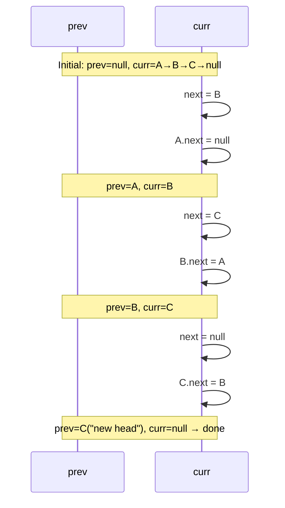

## Question

Reverse a singly linked list. Give both an iterative solution (O(1) space) and a recursive solution (O(n) stack space). Which should you use in production and why?

## Answer

**Iterative (O(1) extra space):**

```
prev = null, curr = head
while curr != null:
    next = curr.next     # save
    curr.next = prev     # reverse pointer
    prev = curr          # advance prev
    curr = next          # advance curr
return prev
```



**Recursive (O(n) stack space):**

```
def reverse(node):
    if node is None or node.next is None:
        return node
    new_head = reverse(node.next)
    node.next.next = node   # make next point back
    node.next = None        # break forward link
    return new_head
```

The recursive version is elegant but risks a stack overflow for very long lists (each frame holds a reference to the node). For a list of length 10,000 in a language with a small default stack, it will crash.

**Production choice:** Iterative — constant stack space, no overflow risk, and often faster due to no function call overhead.

**Reverse a sublist (LeetCode 92 variant):** Find the predecessor of position `m`, reverse `m..n` using the same pointer dance, then re-attach.

## Follow-ups

- How do you reverse every K nodes in a linked list?
- How would you reverse a doubly linked list?
- You have two linked lists that converge at a node — how do you find the intersection?
