## Question

Trace the Linux boot sequence from power-on to the first user-space process: BIOS/UEFI, bootloader (GRUB), kernel decompression, initramfs, and systemd initialization. What runs at each stage?

## Answer

**Complete boot sequence:**

```mermaid
flowchart LR
    Power[Power On] --> BIOS["BIOS/UEFI\n(POST, hardware init,\nfind bootable device)"]
    BIOS --> GRUB["GRUB/bootloader\n(select kernel,\nload vmlinuz + initrd)"]
    GRUB --> Decompress["Kernel decompression\n(vmlinuz → bzImage)"]
    Decompress --> StartKernel["start_kernel()\narch init, mm, sched"]
    StartKernel --> Initramfs["Mount initramfs\n(tmpfs root)\nload drivers for real FS"]
    Initramfs --> PivotRoot["Pivot to real root\n(/dev/sda1)\nunmount initramfs"]
    PivotRoot --> Init["PID 1 = systemd\nor sysvinit/openrc"]
    Init --> Targets["systemd targets:\nbasic.target\nnetwork.target\nmulti-user.target"]
    Targets --> User["Login / services\nrunning"]
```



**Stage 1 — BIOS/UEFI:**
- BIOS: POST (power-on self-test), finds boot device by MBR (Master Boot Record).
- UEFI: Reads GPT partition table, finds EFI System Partition (ESP), loads bootloader directly. Faster, supports Secure Boot.

**Stage 2 — GRUB:**
- Loads kernel image (`/boot/vmlinuz-...`) and initial RAM disk (`initrd.img`) into memory.
- Passes kernel command line arguments (`root=/dev/sda1 quiet splash`).

**Stage 3 — Kernel initialization:**
- Decompresses itself (vmlinuz is a compressed bzImage).
- `start_kernel()`: initializes memory management, scheduler, interrupt handling, device drivers.
- Mounts initramfs as temporary root filesystem.

**Stage 4 — initramfs:**
- A minimal in-memory filesystem (cpio archive) containing busybox, essential drivers.
- Purpose: load drivers for the root filesystem (LVM, RAID, encrypted disk) before the real root is accessible.
- `init` script in initramfs runs `switch_root` to pivot to real root partition.

**Stage 5 — PID 1 (systemd):**
- `exec` the real init (usually `/lib/systemd/systemd`).
- Reads unit files, builds dependency graph.
- Starts units in parallel (unlike sysvinit's sequential scripts).
- Reaches `multi-user.target` → services running.

```bash
systemd-analyze blame          # show time each unit took to start
systemd-analyze critical-chain # show the critical path of boot
bootctl status                 # UEFI boot entry info
journalctl -b                  # all logs from current boot
journalctl -b -1               # logs from previous boot (for crash diagnosis)
```

## Follow-ups

- What is Secure Boot and how does it verify the bootloader and kernel?
- What is the `rd.break` kernel parameter and how do you use it to enter a recovery shell?
- How does a container "boot" — what happens when `docker run` starts a container?
