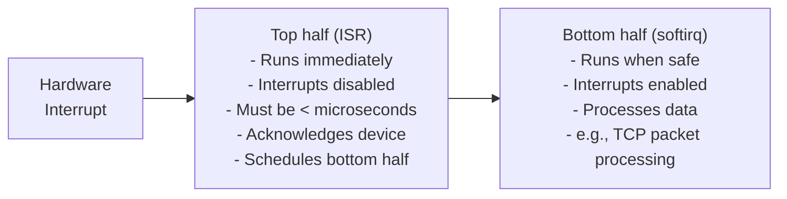

## Question

Explain hardware interrupts and software interrupts (softirqs) in Linux: the top half / bottom half split, how NAPI improves network interrupt handling, and how to diagnose interrupt storms.

## Answer

**Hardware interrupt (IRQ):** When a device (NIC, disk, keyboard) has data ready, it signals the CPU via an interrupt. The CPU stops current work and runs the Interrupt Service Routine (ISR).

**Top half / bottom half split:**

The ISR must be fast (interrupts disabled on the CPU). Non-urgent work is deferred:



**Softirq types:**
```bash
cat /proc/softirqs
#               CPU0        CPU1    ...
# HI:              0           0
# TIMER:   123456789    12345678
# NET_TX:       1234        5678   ← network transmit
# NET_RX:   98765432    76543210   ← network receive
# BLOCK:      456789      456789   ← block device I/O
# TASKLET:      1234        1234
# SCHED:   234567890   123456789
# RCU:     123456789   234567890
```

**NAPI (New API) — interrupt moderation:**

High-speed NICs can generate 10M interrupts/second. Without mitigation, the CPU spends all time handling interrupts, not processing data.

NAPI solution:
1. Interrupt fires for first packet.
2. Driver disables NIC interrupts, enters poll mode.
3. kernel's `net_rx_action` softirq polls NIC for packets (budget = 64 packets).
4. Re-enables interrupts after budget exhausted or ring empty.

```bash
# See NAPI poll stats
ethtool -S eth0 | grep -i poll
cat /proc/net/netstat | grep SoftIrq
```

**IRQ affinity:** Bind specific IRQs to specific CPUs (NUMA locality, avoid interrupt storm on CPU 0):
```bash
cat /proc/interrupts | head -20        # IRQ counts per CPU
echo "3" > /proc/irq/<irq_num>/smp_affinity  # bind to CPU 0,1
# Or use irqbalance daemon for auto-balancing
```

**Diagnosing interrupt storms:**
```bash
watch -n 1 cat /proc/interrupts         # monitor counts
mpstat -I SUM 1                         # interrupt rate per CPU
# High interrupts on CPU 0 + low on others → IRQ affinity misconfiguration
```

**`ksoftirqd`:** Kernel thread that runs softirqs when load is high. If it consumes significant CPU, you have a softirq storm.

## Follow-ups

- What is an NMI (Non-Maskable Interrupt) and when does the kernel use it?
- How does `irqbalance` decide which CPUs to assign IRQs to?
- How does XDP (express data path) bypass softirqs entirely for packet processing?
