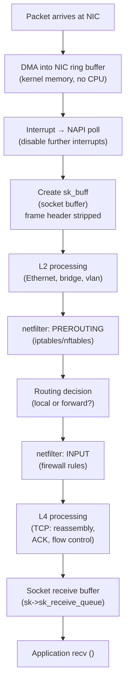

## Question

Trace an incoming TCP packet from NIC to the application: DMA into ring buffer, NAPI poll, protocol stack processing, netfilter/iptables hooks, socket buffer, and the `recv()` call. Where can each stage become a bottleneck?

## Answer

**Packet journey from NIC to application:**



**Key data structures:**

- **`sk_buff` (skb):** The kernel's network packet structure. Contains: data pointers, protocol headers, metadata (interface, timestamp, mark). Passed through all network layers without copying data (just pointer manipulation).

- **NIC ring buffer:** A fixed-size circular buffer of pre-allocated DMA descriptors. NIC fills them; kernel drains them. If the kernel is too slow → ring buffer fills → **packet drop (RX drop)**.

**Bottleneck stages:**

1. **NIC ring buffer overflow:** `ethtool -G eth0 rx 4096` — increase ring buffer size.
2. **Softirq overloaded:** `NET_RX` softirq runs on one CPU → IRQ affinity tuning.
3. **Socket receive buffer full:** `setsockopt(SO_RCVBUF)` or `net.core.rmem_max`.
4. **Application not reading fast enough:** `recv()` rate too slow → buffer fills → TCP window closes (backpressure).

**Monitoring drops:**
```bash
ethtool -S eth0 | grep -i drop      # NIC-level drops
netstat -s | grep "receive errors"   # IP/TCP errors
cat /proc/net/dev | awk '/eth0/{print $3, $5}'  # RX packets, errs
ss -s                                # socket statistics
```

**Netfilter hooks (iptables):**
- `PREROUTING`: before routing (NAT, DNAT).
- `INPUT`: packets to local process.
- `FORWARD`: packets forwarded (router).
- `OUTPUT`: locally generated.
- `POSTROUTING`: after routing (SNAT, masquerade).

**XDP bypass:** For ultra-high performance, XDP hooks at the NIC driver level — before `sk_buff` allocation, before all of the above. 10-100M packets/sec possible.

## Follow-ups

- What is GRO (Generic Receive Offload) and how does it reduce per-packet overhead?
- How does the RSS (Receive-Side Scaling) distribute packets across CPU cores via IRQ affinity?
- How does Cilium replace iptables with eBPF for Kubernetes pod networking?
