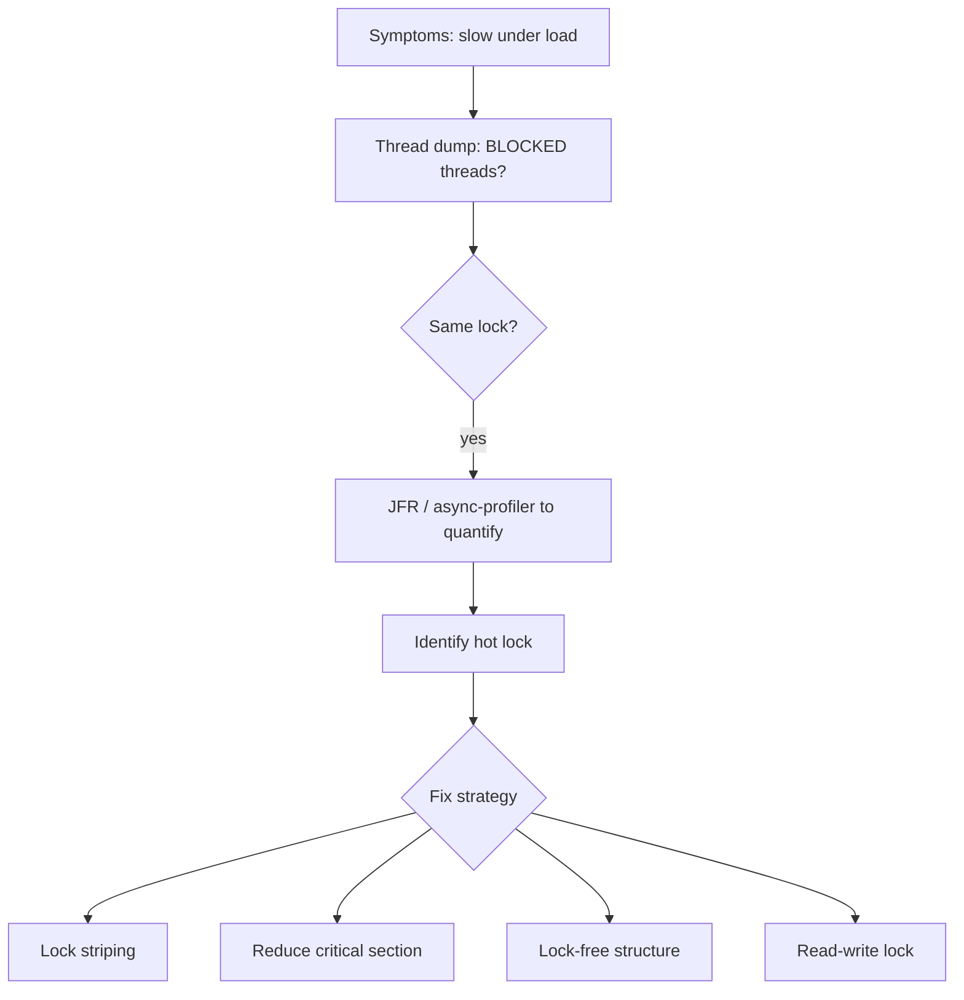

## Question

Production service is slow under load — suspected lock contention. Walk through the tools and methodology to diagnose and quantify contention in a JVM application, from thread dumps through async-profiler to Java Flight Recorder.

## Answer

**Symptoms of lock contention:**
- High CPU on some threads but low throughput.
- Thread dump shows many `BLOCKED` threads on the same monitor.
- Latency spikes under load that don't appear at low concurrency.
- `jstat -gccause` shows GC isn't the cause.

**Diagnosis steps:**

**Step 1 — Thread dump (quick):**
```bash
jstack <pid> | grep -A 5 "BLOCKED"
```
Look for: many threads blocked on the same `<0x...>` address. Identify the lock owner.

**Step 2 — `jcmd` + JFR (Java Flight Recorder):**
```bash
jcmd <pid> JFR.start duration=60s filename=/tmp/recording.jfr
# analyze with JMC (Java Mission Control)
```
JFR's "Lock Instances" event shows which locks have the most contention, blocked threads, and wait time.

**Step 3 — async-profiler (best for lock profiling):**
```bash
./asprof -e lock -d 30 -f /tmp/lock.html <pid>
```
Produces a flamegraph of which code paths acquire the most-contended locks. Shows actual blocking time per lock.

**Step 4 — `-XX:+PrintConcurrentLocks` / `-XX:+PrintBiasedLockingStatistics:**
Lightweight JVM flags showing lock inflation statistics.



**Fix strategies:**
1. **Reduce lock scope** — move non-shared work outside the synchronized block.
2. **Lock striping** — split one lock into N locks (e.g., ConcurrentHashMap approach).
3. **Lock-free** — replace with `AtomicInteger`, `ConcurrentHashMap`.
4. **Read-write lock** — if reads dominate.
5. **Thread confinement** — redesign to avoid sharing.
6. **Queue-based design** — producers enqueue, single-threaded consumer processes.

## Follow-ups

- How do you measure lock wait time vs hold time with JFR?
- What is the difference between a "hot lock" and a "hot method" in profiling?
- How does async-profiler's lock profiling differ from sampling-based CPU profiling?
