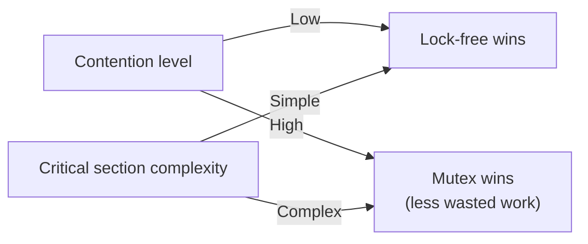

## Question

What does "lock-free" mean formally? Describe a lock-free stack or queue using CAS. When do lock-free structures actually outperform mutex-based ones, and when is locking still better?

## Answer

**Formal definitions:**

- **Lock-free:** At least one thread makes progress in a finite number of steps, regardless of what other threads do. Individual threads can starve but the *system* always progresses.
- **Wait-free:** Every thread makes progress in a finite number of steps. Strongest guarantee. Hard to implement efficiently.
- **Obstruction-free:** A thread makes progress if it runs in isolation. Weaker than lock-free.

**Lock-free stack using CAS:**

```python
class Node:
    def __init__(self, val): self.val = val; self.next = None

class LockFreeStack:
    def __init__(self): self.top = None  # atomic reference

    def push(self, val):
        node = Node(val)
        while True:
            old_top = self.top
            node.next = old_top
            if CAS(self.top, old_top, node):  # atomic
                break  # success

    def pop(self):
        while True:
            old_top = self.top
            if old_top is None: return None
            if CAS(self.top, old_top, old_top.next):
                return old_top.val
```

**When lock-free wins:**
- **Low to medium contention:** CAS succeeds on first try → much lower overhead than acquiring a kernel mutex (which requires a syscall).
- **Real-time systems:** No thread can be descheduled while holding a lock (no priority inversion).
- **Short critical sections:** CAS is a single instruction; mutex lock can take hundreds of ns.

**When locking wins:**
- **High contention:** CAS retry loops waste CPU in a thundering herd (100 threads retrying on the same location → O(n²) CAS attempts total).
- **Complex operations:** Lock-free structures for complex updates (trees, hash maps) are extremely difficult to implement correctly. Bugs are subtle and rare.
- **Memory management:** Lock-free requires careful epoch-based or hazard pointer reclamation to avoid use-after-free.



**Real examples:**
- `java.util.concurrent.ConcurrentLinkedQueue` — Michael-Scott lock-free queue.
- `java.util.concurrent.atomic.*` — thin wrappers over CAS.
- Linux kernel's RCU (Read-Copy-Update) — lock-free reads, lock-protected writes.

## Follow-ups

- What is the Michael-Scott queue algorithm and why does it need two CAS operations for enqueue?
- How does RCU (Read-Copy-Update) achieve lock-free reads?
- Explain why the Java `ConcurrentHashMap` uses a hybrid of CAS and synchronized blocks.
