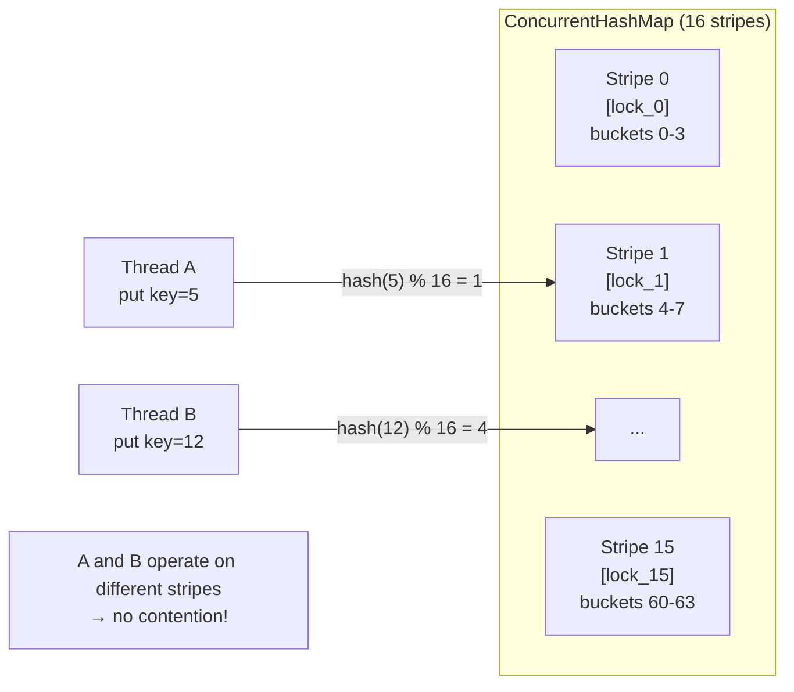

## Question

Explain lock striping as a technique to reduce lock contention. Describe how Java's `ConcurrentHashMap` uses it (pre-Java 8 segments, Java 8+ bin-level locking), and how it differs from a fully synchronized `HashMap`.

## Answer

**Problem with a single lock:** A `Collections.synchronizedMap(hashMap)` wraps every operation in a single `synchronized` block. Under high concurrency, all threads contend on one lock → serialized access, no parallelism.

**Lock striping:** Divide the protected data structure into N independent segments (stripes), each with its own lock. Operations on different stripes proceed in parallel.

**Java 7 `ConcurrentHashMap`:** 16 `Segment` objects, each a mini hash table with its own `ReentrantLock`. Concurrency level = 16.

**Java 8 `ConcurrentHashMap` (redesigned):**
- No `Segment` objects.
- Locking is **per-bucket (bin)**. Only the head node of each bucket chain is `synchronized`.
- Reads are completely lock-free (use volatile + CAS).
- For empty buckets: CAS to insert. For non-empty: `synchronized(head)`.
- When bucket overflows 8 nodes: converts to Red-Black tree (same treeification from HashMap).
- Reduces contention to per-key-hash-bucket granularity — effectively N-way striping where N = number of buckets.

**Operations:**
- `get()`: Lock-free. Read volatile references.
- `put()`: CAS if empty bin; `synchronized(bin_head)` if non-empty.
- `size()`: Approximate using `LongAdder` — avoids contention on a single count.

**`LongAdder` trick:** Instead of one `AtomicLong`, use an array of `Cell`s. Each thread updates a different cell (striped counter). Sum them for total. Reduces contention from O(threads) to O(1) per operation.

## Follow-ups

- Why does `ConcurrentHashMap` not allow null keys or values, while `HashMap` does?
- What is `computeIfAbsent` and how does it atomically handle the check-then-act pattern?
- How does `ConcurrentSkipListMap` differ from `ConcurrentHashMap`?
