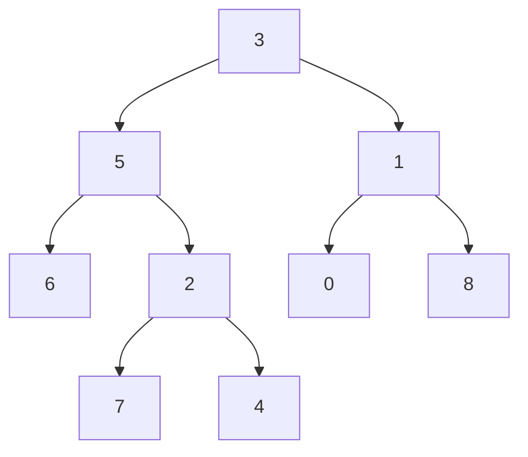

## Question

Given a binary tree (not necessarily a BST) and two nodes p and q, find their Lowest Common Ancestor. Walk through the O(n) recursive solution and explain why it's correct. Then discuss the O(log n) solution for balanced trees with preprocessing.

## Answer

**Definition:** The LCA of p and q is the deepest node that is an ancestor of both p and q. A node is an ancestor of itself.

**O(n) recursive approach (no parent pointers):**

```python
def lowestCommonAncestor(root, p, q):
    if not root or root == p or root == q:
        return root   # found a target or hit null
    
    left  = lowestCommonAncestor(root.left,  p, q)
    right = lowestCommonAncestor(root.right, p, q)
    
    if left and right:
        return root   # p found on left, q on right → root is LCA
    return left if left else right  # both on same side
```

**Why it's correct:**
- Each call returns: a target node if found in that subtree, or None.
- If both left and right return non-null, p and q are in different subtrees → current root is LCA.
- If only one side returns non-null, both nodes are in that subtree → propagate the answer up.


LCA(5, 4) = 5 (5 is an ancestor of 4).
LCA(5, 1) = 3 (root).

**BST shortcut:** If it's a BST, compare values: if both p and q < root, go left; if both > root, go right; else root is LCA. O(h) where h = tree height.

**O(log n) with preprocessing (Euler tour + sparse table):**
1. Euler tour of tree: record nodes in DFS order with depths.
2. The LCA of u and v is the minimum-depth node between their first occurrences in the Euler tour.
3. Build a sparse table for range minimum queries → O(1) per query after O(n log n) preprocessing.
Used when you have millions of LCA queries on the same tree.

**With parent pointers:** Find depths of p and q, bring the deeper one up to the same level, then advance both until they meet. O(depth).

## Follow-ups

- LCA of k nodes (multiple targets) — how does the algorithm generalize?
- LCA in a Directed Acyclic Graph (not a tree) — significantly harder. Explain the approach.
- How does LCA relate to RMQ (Range Minimum Query)?
